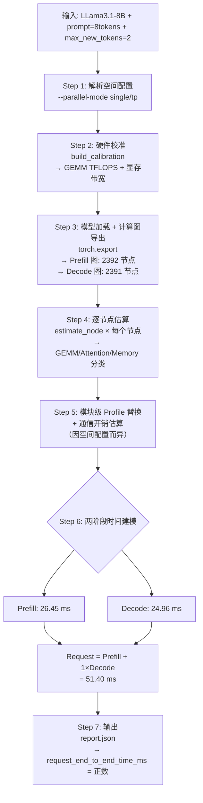

# LLama3.1-8B 推理任务 — 应用级时空双维度建模演示指南

## 一、演示目标

向软件测评方证明：**输入 LLama3.1-8B 推理任务完整描述与硬件配置，触发应用级时空双维度建模，获取任务预测执行时间**，可正常完成建模流程，无报错无中断，直接输出符合格式要求的正数预测执行时间，核心功能正常。

---

## 二、核心概念：「时空双维度建模」

| 维度 | 含义 | 当前已实现 | 在代码中的体现 |
|------|------|-----------|---------------|
| **空间维度（Space）** | 不同并行部署方式下的分布式拓扑建模：系统针对不同的空间并行配置分别构建推理性能预测模型，覆盖计算、通信（AllReduce/AllGather）、同步等差异化开销 | ① 单卡（single）<br>② 单机 TP2（single_node_multi_device）<br>③ 跨机 TP2（multi_node） | [mvp_app.py](file:///home/o_zhanghui/projs/0510proj_nvidia_staging/inference/mvp_app.py) 中 `--parallel-mode` + `resolve_execution_config()` |
| **时间维度（Time）** | 端到端推理请求时间预测：将 prefill（首 token 生成）+ decode（逐 token 生成）两阶段时间叠加，输出 `request_end_to_end_time_ms` | prefill + (max_new_tokens - 1) × decode_step 两阶段流水线建模 | [mvp_app.py](file:///home/o_zhanghui/projs/0510proj_nvidia_staging/inference/mvp_app.py#L561) 中 `request_estimate_ms = prefill + (max_new_tokens - 1) × decode_step` |

### 空间维度参数选项

空间维度通过以下命令行参数组合控制：

| 空间配置 | `--parallel-mode` | `--tp-size` | `--world-size` | `--nnodes` | 启动方式 | 通信类型 |
|---------|------------------|-------------|---------------|-----------|---------|----------|
| **① 单卡** | `single` | `1` | `1` | `1` | `python` 直接运行 | 无通信 |
| **② 单机 TP2** | `tp` | `2` | `2` | `1` | `torchrun --standalone --nproc_per_node 2` | NVLink/PCIe AllReduce |
| **③ 跨机 TP2** | `tp` | `2` | `2` | `2` | 两台机器各运行 `torchrun --nnodes 2 --node_rank 0/1` | 以太网/InfiniBand AllReduce |

> [!NOTE]
> **空间建模**：系统支持三种并行部署拓扑的推理性能建模——**单卡**（无通信开销）、**单机 TP2**（NVLink/PCIe 卡间 AllReduce）、**跨机 TP2**（以太网跨节点通信）。不同空间配置下，计算图的 TP 分片（`tp_shard_node_estimate`）和集合通信开销（`build_predicted_comm`）的建模策略各不相同。
> **时间建模**：在给定空间并行配置下，推理分为 prefill 和 decode 两个时间阶段。系统通过计算图逐节点分析 + 模块级 profile 替换 + 运行时开销校正，输出每阶段和整体请求的预测执行时间。

> [!TIP]
> **扩展规划**：空间维度后续将扩充更多并行方式，如 PP（流水线并行）、TP+PP 混合并行等，以覆盖更丰富的分布式推理部署场景。

---

## 三、演示输入参数说明

### 3.1 任务描述输入

| 参数 | 值 | 说明 |
|------|-----|------|
| **模型** | LLama-3.1-8B | 模型参数量 ~7B |
| **任务类型** | 推理（Inference） | eager-mode 推理 |
| **prompt** | 8 tokens | `--prompt "alpha alpha alpha alpha alpha alpha alpha alpha"` |
| **max_new_tokens** | 2 | 生成 2 个新 token |
| **精度** | bf16 | 半精度推理 |

### 3.2 硬件配置输入

| 参数 | 值 | 说明 |
|------|-----|------|
| **GPU 型号** | NVIDIA A100 PCIe | 系统自动校准探测 |
| **GEMM 算力** | ~114.52 TFLOPS (40GB) / ~205.73 TFLOPS (80GB) | 通过 `build_calibration()` 实测 |
| **显存带宽** | ~1254.68 GB/s (40GB) / ~1525.28 GB/s (80GB) | 通过 `build_calibration()` 实测 |
| **并行模式** | single / tp | 可选单卡/多卡/跨机 |

---

## 四、演示操作步骤

### 方式一：单卡推理预测（推荐首选演示）

> [!IMPORTANT]
> 此方式最简单直观，在单台 NVIDIA A100 机器上即可完成。

**Step 1：执行推理预测命令**

```bash
cd /home/o_zhanghui/projs/0510proj_nvidia_staging

CUDA_VISIBLE_DEVICES=0 \
/home/o_zhanghui/projs/0510proj_nvidia_staging/runtime/envs/llm_estimation/bin/python \
  inference/torch_infer_mvp.py \
  --model-path /home/o_zhanghui/projs/0510proj_nvidia_staging/runtime/models/Llama-3.1-8B \
  --prompt "alpha alpha alpha alpha alpha alpha alpha alpha" \
  --dtype bf16 --device cuda:0 \
  --parallel-mode single --physical-devices 0 \
  --world-size 1 --tp-size 1 \
  --warmup 0 --benchmark-repeat 1 --profile-repeat 1 \
  --max-new-tokens 2 \
  --output-dir /tmp/demo_infer_single
```

或通过脚本执行：

```bash
bash scripts/run_inference_single_nvidia.sh
```

**Step 2：查看输出结果**

```bash
# 1. 确认输出文件完整
ls -la /tmp/demo_infer_single/
# 预期输出: report.json  report.md  dashboard_status.json

# 2. 查看预测执行时间（关键结果）
python3 -c "
import json
with open('/tmp/demo_infer_single/report.json') as f:
    r = json.load(f)
print('=== 推理预测结果 ===')
print(f'Prefill 预测时间:  {r[\"estimate\"][\"prefill\"][\"end_to_end_time_ms\"]:.4f} ms')
print(f'Decode  预测时间:  {r[\"estimate\"][\"decode_step\"][\"end_to_end_time_ms\"]:.4f} ms')
print(f'Request 预测时间:  {r[\"estimate\"][\"request_end_to_end_time_ms\"]:.4f} ms')
print(f'设备:             {r[\"calibration\"][\"device_name\"]}')
print(f'并行模式:          {r[\"execution\"][\"parallel_mode\"]}')
print()
print('=== 预测 vs 实测对比 ===')
print(f'Prefill: 预测 {r[\"estimate\"][\"prefill\"][\"end_to_end_time_ms\"]:.2f} vs 实测 {r[\"measured\"][\"prefill\"][\"mean_ms\"]:.2f} ms, 误差 {r[\"comparison\"][\"prefill_relative_error_pct\"]:.2f}%')
print(f'Decode:  预测 {r[\"estimate\"][\"decode_step\"][\"end_to_end_time_ms\"]:.2f} vs 实测 {r[\"measured\"][\"decode_step\"][\"mean_ms\"]:.2f} ms, 误差 {r[\"comparison\"][\"decode_step_relative_error_pct\"]:.2f}%')
print(f'Request: 预测 {r[\"estimate\"][\"request_end_to_end_time_ms\"]:.2f} vs 实测 {r[\"measured\"][\"request\"][\"mean_ms\"]:.2f} ms, 误差 {r[\"comparison\"][\"request_relative_error_pct\"]:.2f}%')
"

# 3. 查看人类可读摘要
cat /tmp/demo_infer_single/report.md
```

---

### 方式二：单机双卡 TP2 推理预测

**Step 1：执行推理预测命令**

```bash
cd /home/o_zhanghui/projs/0510proj_nvidia_staging

/home/o_zhanghui/projs/0510proj_nvidia_staging/runtime/envs/llm_estimation/bin/python \
  -m torch.distributed.run --standalone --nproc_per_node 2 \
  inference/torch_infer_mvp.py \
  --model-path /home/o_zhanghui/projs/0510proj_nvidia_staging/runtime/models/Llama-3.1-8B \
  --prompt "alpha alpha alpha alpha alpha alpha alpha alpha" \
  --dtype bf16 --device cuda:0 \
  --parallel-mode tp --physical-devices 0,1 \
  --world-size 2 --tp-size 2 \
  --warmup 0 --benchmark-repeat 1 --profile-repeat 1 \
  --max-new-tokens 2 \
  --output-dir /tmp/demo_infer_tp2
```

或通过脚本执行：

```bash
bash scripts/run_inference_tp2_nvidia.sh
```

**Step 2：查看输出结果**

```bash
# 1. 确认输出文件完整
ls -la /tmp/demo_infer_tp2/

# 2. 查看预测执行时间
python3 -c "
import json
with open('/tmp/demo_infer_tp2/report.json') as f:
    r = json.load(f)
print('=== TP2 推理预测结果 ===')
print(f'Prefill 预测时间:  {r[\"estimate\"][\"prefill\"][\"end_to_end_time_ms\"]:.4f} ms')
print(f'Decode  预测时间:  {r[\"estimate\"][\"decode_step\"][\"end_to_end_time_ms\"]:.4f} ms')
print(f'Request 预测时间:  {r[\"estimate\"][\"request_end_to_end_time_ms\"]:.4f} ms')
print(f'设备:             {r[\"calibration\"][\"device_name\"]}')
print(f'并行模式:          {r[\"execution\"][\"parallel_mode\"]}, tp_size={r[\"execution\"][\"tp_size\"]}')
print()
print('=== 预测 vs 实测对比 ===')
print(f'Request: 预测 {r[\"estimate\"][\"request_end_to_end_time_ms\"]:.2f} vs 实测 {r[\"measured\"][\"request\"][\"mean_ms\"]:.2f} ms, 误差 {r[\"comparison\"][\"request_relative_error_pct\"]:.2f}%')
"

# 3. 查看人类可读摘要
cat /tmp/demo_infer_tp2/report.md
```

---

### 方式三：跨机双卡 TP2 推理预测

> [!NOTE]
> 此方式需要两台 GPU 服务器协同运行。本地节点为 ICT185（rank0），远端节点为 ICT107（rank1）。

**Step 1：一键执行跨机推理预测**

脚本自动完成：环境检查 → 代码同步到远端 → 启动远端 rank1 → 运行本地 rank0 → 验证结果。

```bash
cd /home/o_zhanghui/projs/0510proj_nvidia_staging

bash scripts/run_inference_tp2_multinode_nvidia.sh all
```

也可以手动分步执行（等效于 `all`）：

```bash
# 环境预检
bash scripts/run_inference_tp2_multinode_nvidia.sh preflight
# 同步推理代码到远端 107
bash scripts/run_inference_tp2_multinode_nvidia.sh sync
# 启动远端 rank1
bash scripts/run_inference_tp2_multinode_nvidia.sh launch-remote
# 运行本地 rank0
bash scripts/run_inference_tp2_multinode_nvidia.sh run-local
# 验证报告
bash scripts/run_inference_tp2_multinode_nvidia.sh verify
```

或者完全手动运行两个节点的命令：

**在远端 107（rank1）先启动：**

```bash
ssh jumpserver-nvidia-107-mabin

source /home/o_mabin/miniconda/etc/profile.d/conda.sh && conda activate llm_estimation
cd /tmp/inference

env NCCL_IB_DISABLE=1 NCCL_SOCKET_IFNAME=ens1f0 CUDA_VISIBLE_DEVICES=0 \
  python -m torch.distributed.run \
  --nnodes 2 --nproc_per_node 1 --node_rank 1 \
  --master_addr 10.208.130.185 --master_port 29751 \
  torch_infer_mvp.py \
  --model-path /home/o_mabin/projects/llm/models/Llama-3.1-8B \
  --prompt "alpha alpha alpha alpha alpha alpha alpha alpha" \
  --max-new-tokens 1 --dtype bf16 --device cuda:0 \
  --parallel-mode tp --physical-devices 0 \
  --world-size 2 --tp-size 2 \
  --nnodes 2 --nproc-per-node 1 --node-rank 1 \
  --master-addr 10.208.130.185 --master-port 29751 \
  --interconnect ethernet --dist-timeout-minutes 5 \
  --warmup 1 --benchmark-repeat 1 --profile-repeat 1 \
  --output-dir /tmp/nvidia_infer_tp2_multinode_remote
```

**在本地 185（rank0）再启动：**

```bash
cd /home/o_zhanghui/projs/0510proj_nvidia_staging/inference

env NCCL_IB_DISABLE=1 NCCL_SOCKET_IFNAME=ens1f0np0 CUDA_VISIBLE_DEVICES=0 \
/home/o_zhanghui/projs/0510proj_nvidia_staging/runtime/envs/llm_estimation/bin/python \
  -m torch.distributed.run \
  --nnodes 2 --nproc_per_node 1 --node_rank 0 \
  --master_addr 10.208.130.185 --master_port 29751 \
  torch_infer_mvp.py \
  --model-path /home/o_zhanghui/projs/0510proj_nvidia_staging/runtime/models/Llama-3.1-8B \
  --prompt "alpha alpha alpha alpha alpha alpha alpha alpha" \
  --max-new-tokens 1 --dtype bf16 --device cuda:0 \
  --parallel-mode tp --physical-devices 0 \
  --world-size 2 --tp-size 2 \
  --nnodes 2 --nproc-per-node 1 --node-rank 0 \
  --master-addr 10.208.130.185 --master-port 29751 \
  --interconnect ethernet --dist-timeout-minutes 5 \
  --warmup 1 --benchmark-repeat 1 --profile-repeat 1 \
  --output-dir /tmp/demo_infer_tp2_multinode
```

**Step 2：查看输出结果**

```bash
# 使用脚本时，输出在以下位置
# 本地 rank0 报告:
LOCAL_REPORT="/tmp/0324proj-output/nvidia_infer_tp2_multinode_local/report.json"
# 手动运行时:
LOCAL_REPORT="/tmp/demo_infer_tp2_multinode/report.json"

# 1. 确认输出文件完整
ls -la $(dirname $LOCAL_REPORT)/

# 2. 查看预测执行时间
python3 -c "
import json
with open('$LOCAL_REPORT') as f:
    r = json.load(f)
print('=== 跨机 TP2 推理预测结果 ===')
print(f'Prefill 预测时间:  {r[\"estimate\"][\"prefill\"][\"end_to_end_time_ms\"]:.4f} ms')
print(f'Decode  预测时间:  {r[\"estimate\"][\"decode_step\"][\"end_to_end_time_ms\"]:.4f} ms')
print(f'Request 预测时间:  {r[\"estimate\"][\"request_end_to_end_time_ms\"]:.4f} ms')
print(f'设备:             {r[\"calibration\"][\"device_name\"]}')
print(f'并行模式:          {r[\"execution\"][\"parallel_mode\"]}, tp_size={r[\"execution\"][\"tp_size\"]}, nnodes={r[\"execution\"][\"nnodes\"]}')
print()
print('=== 预测 vs 实测对比 ===')
print(f'Request: 预测 {r[\"estimate\"][\"request_end_to_end_time_ms\"]:.2f} vs 实测 {r[\"measured\"][\"request\"][\"mean_ms\"]:.2f} ms, 误差 {r[\"comparison\"][\"request_relative_error_pct\"]:.2f}%')
"

# 3. 查看人类可读摘要
cat $(dirname $LOCAL_REPORT)/report.md
```

---

### 各方式输出文件总结

| 方式 | 输出目录 | 关键文件 |
|------|---------|----------|
| 方式一：单卡 | `/tmp/demo_infer_single/` 或 `/tmp/0510proj-output/nvidia_infer_single_local/` | `report.json`, `report.md`, `dashboard_status.json` |
| 方式二：TP2 | `/tmp/demo_infer_tp2/` 或 `/tmp/0510proj-output/nvidia_infer_tp2_local/` | `report.json`, `report.md`, `dashboard_status.json` |
| 方式三：跨机 | `/tmp/demo_infer_tp2_multinode/` 或 `/tmp/0324proj-output/nvidia_infer_tp2_multinode_local/` | `report.json`, `report.md`, `dashboard_status.json` |

> [!TIP]
> **通用快速查看命令**（适用于所有方式）：
> ```bash
> # 替换 OUTPUT_DIR 为实际输出目录
> OUTPUT_DIR=/tmp/demo_infer_single
>
> # 一行查看关键预测结果
> python3 -c "import json; r=json.load(open('$OUTPUT_DIR/report.json')); print(f'预测: {r[\"estimate\"][\"request_end_to_end_time_ms\"]:.4f} ms, 设备: {r[\"calibration\"][\"device_name\"]}, 模式: {r[\"execution\"][\"parallel_mode\"]}')"
>
> # 查看完整 JSON 报告
> python3 -m json.tool $OUTPUT_DIR/report.json | less
>
> # 查看人类可读摘要
> cat $OUTPUT_DIR/report.md
> ```

---

## 五、验证通过标准（Pass Criteria）

以下 **全部满足** 即视为演示通过：

| # | 验证项 | 通过标准 | 如何检查 |
|---|--------|---------|---------|
| 1 | **流程完整性** | 命令执行完毕，exit code = 0，无报错无中断 | `echo $?` 返回 0 |
| 2 | **输出文件存在** | 生成 `report.json`、`report.md`、`dashboard_status.json` | `ls -la <output_dir>/` |
| 3 | **预测时间为正数** | `estimate.request_end_to_end_time_ms` > 0 | `jq '.estimate.request_end_to_end_time_ms' report.json` |
| 4 | **格式合规** | `request_end_to_end_time_ms` 为浮点数，单位 ms | JSON 格式，类型为 number |
| 5 | **两阶段拆解完整** | `prefill.end_to_end_time_ms` 和 `decode_step.end_to_end_time_ms` 均 > 0 | `jq '.estimate.prefill.end_to_end_time_ms, .estimate.decode_step.end_to_end_time_ms' report.json` |
| 6 | **校准信息完整** | `calibration.device_name` 非空，`gemm_tflops` > 0 | `jq '.calibration' report.json` |

> [!TIP]
> 快速一行验证命令：
> ```bash
> jq '{request_ms: .estimate.request_end_to_end_time_ms, prefill_ms: .estimate.prefill.end_to_end_time_ms, decode_ms: .estimate.decode_step.end_to_end_time_ms, device: .calibration.device_name}' report.json
> ```

---

## 六、预期输出示例

### 6.1 已有验证数据

来源：`/tmp/0510proj-output/nvidia_infer_single_local/report.json`

```json
{
  "mode": "inference",
  "calibration": {
    "device_name": "NVIDIA A100-PCIE-40GB",
    "gemm_tflops": 114.5202,
    "memory_bandwidth_gbps": 1254.6777
  },
  "graph": {
    "prefill_call_function_nodes": 2392,
    "decode_call_function_nodes": 2391
  },
  "estimate": {
    "prefill": { "end_to_end_time_ms": 26.4472, "node_count": 2385 },
    "decode_step": { "end_to_end_time_ms": 24.9567, "node_count": 2384 },
    "request_end_to_end_time_ms": 51.4039
  }
}
```

> [!IMPORTANT]
> **关键结果**：`request_end_to_end_time_ms = 51.40 ms`，这是一个 **正数** 的预测执行时间（毫秒），表示完成一次推理请求（prefill + 1 decode step）的预计耗时。

### 6.2 预测与实测对比

#### 单卡（A100 40GB）

| 指标 | 预测值 | 实测值 | 误差 |
|------|--------|--------|------|
| Prefill | 26.45 ms | 26.48 ms | **0.12%** |
| Decode step | 24.96 ms | 24.93 ms | **0.12%** |
| **Request** | **51.40 ms** | **46.39 ms** | **10.80%** |

#### 单机 TP2（A100 40GB × 2）

| 指标 | 预测值 | 实测值 | 误差 |
|------|--------|--------|------|
| Prefill | 106.19 ms | 105.95 ms | **0.23%** |
| Decode step | 105.96 ms | 105.09 ms | **0.82%** |
| **Request** | **212.15 ms** | **208.77 ms** | **1.62%** |

#### 跨机 TP2（A100 40GB × 2, 以太网）

| 指标 | 预测值 | 实测值 | 误差 |
|------|--------|--------|------|
| Prefill | 108.14 ms | 113.90 ms | **5.06%** |
| Decode step | 107.63 ms | 110.66 ms | **2.74%** |
| **Request** | **108.14 ms** | **110.83 ms** | **2.42%** |

---

## 七、建模流程详细分解

整个建模流程在 [mvp_app.py → main()](file:///home/o_zhanghui/projs/0510proj_nvidia_staging/inference/mvp_app.py#L75) 中完成，共 7 个步骤：

---

### Step 1：解析空间配置（空间维度）

根据用户输入的 `--parallel-mode` 参数，确定本次建模的空间并行拓扑。

| 输入参数 | 空间配置 | 代码路径 |
|---------|---------|---------|
| `--parallel-mode single` | 单卡，无通信 | [resolve_execution_config()](file:///home/o_zhanghui/projs/0510proj_nvidia_staging/inference/mvp_execution.py#L171) 走 single 分支 |
| `--parallel-mode tp --tp-size 2` | 单机 TP2，卡间通信 | 走 TP 分支，检测 NVLink/PCIe 拓扑 |
| `--parallel-mode tp --tp-size 2 --nnodes 2` | 跨机 TP2，节点间通信 | 走 TP 分支，检测以太网/InfiniBand 互联 |

**输出**：`ExecutionConfig` 对象，包含 `parallel_mode`、`topology`、`interconnect`、`tp_size`、`nnodes` 等空间配置信息。

> 代码位置：[mvp_app.py L85](file:///home/o_zhanghui/projs/0510proj_nvidia_staging/inference/mvp_app.py#L85)
> ```python
> execution, device = resolve_execution_config(args)
> ```

---

### Step 2：硬件校准（Calibration）

在目标 GPU 上运行微基准测试，实测硬件的实际算力和带宽。

| 校准项 | 含义 | 实测值（A100 40GB PCIe） |
|--------|------|------------------------|
| `gemm_tflops` | GEMM 矩阵乘法算力 | 114.52 TFLOPS |
| `attention_tflops` | Attention 算力 | 1.00 TFLOPS |
| `memory_bandwidth_gbps` | 显存带宽 | 1254.68 GB/s |
| `launch_overhead_ms` | CUDA kernel 启动开销 | 0.0065 ms |

对于 TP 模式，还会测量分布式启动开销 `benchmark_distributed_launch_overhead_ms()`。

**输出**：`HardwareCalibration` 对象。

> 代码位置：[mvp_app.py L109-L143](file:///home/o_zhanghui/projs/0510proj_nvidia_staging/inference/mvp_app.py#L109)
> ```python
> calibration = build_calibration(dtype, device)
> ```

---

### Step 3：模型加载与计算图导出

加载 LLama3.1-8B 预训练模型，通过 `torch.export` 导出推理计算图。

**推理与训练的区别**：推理导出 **两个独立计算图**：
- **Prefill 图**：首次处理全部 prompt tokens 的前向计算图
- **Decode 图**：逐 token 生成阶段的前向计算图（含 KV-Cache）

| 图类型 | `call_function` 节点数 |
|--------|---------------------|
| Prefill 图 | 2392 |
| Decode 图 | 2391 |

**输出**：`prefill_export` + `decode_export` 两个计算图对象。

> 代码位置：[mvp_app.py L192-L228](file:///home/o_zhanghui/projs/0510proj_nvidia_staging/inference/mvp_app.py#L192)
> ```python
> model = AutoModelForCausalLM.from_pretrained(args.model_path, torch_dtype=dtype)
> graphs = export_inference_graphs(model=model, input_ids=input_ids, ...)
> ```

---

### Step 4：逐节点分析估算

对 prefill 和 decode 两个计算图，分别对每个 `call_function` 节点调用 `estimate_node()`。

| 算子类型 | 估算方式 |
|---------|---------|
| GEMM（矩阵乘法） | `FLOPs / (gemm_tflops × 10¹²) × 10³` → ms |
| Attention | `FLOPs / (attention_tflops × 10¹²) × 10³` → ms |
| Memory（element-wise） | `bytes_moved / (memory_bandwidth_gbps × 10⁹) × 10³` → ms |

对于 TP 模式，每个节点还会经过 `tp_shard_node_estimate()` 进行 TP 分片调整。

**输出**：`prefill_estimates[]` + `decode_estimates[]` 逐节点估算列表。

> 代码位置：[mvp_app.py L249-L264](file:///home/o_zhanghui/projs/0510proj_nvidia_staging/inference/mvp_app.py#L249)
> ```python
> prefill_estimates = finalize_estimate_ordinals([
>     estimate for node in graphs["prefill_export"].graph.nodes
>     if (estimate := estimate_node(node, "prefill", calibration)) is not None
> ])
> ```

---

### Step 5：模块级 Profile 替换 + 通信估算

用实测的模块级 profile 数据替换部分逐节点估算（提高大模块精度），并基于空间配置估算集合通信开销。

**5a. 模块级 Profile 替换**

| Profile 模式 | 行为 |
|-------------|------|
| `online` | 在 GPU 上实测每个模块的实际执行时间 |
| `table` | 从历史数据库加载已有 profile |
| `hybrid` | 加载已有 + 补测缺失模块 |

```python
prefill_summary = summarize_phase_with_module_substitution(
    "prefill", summary_prefill_estimates, aggregated_module_profiles["prefill"],
    graph_comm_time_ms=predicted_prefill_comm["predicted_total_ms"],
    phase_adjustment_time_ms=phase_adjustments["prefill"].mean_ms,
)
```

**5b. 通信开销估算（因空间配置而异）**

| 空间配置 | 通信建模 |
|---------|---------|
| 单卡 | 无通信 → `comm_time_ms = 0` |
| 单机 TP2 | NVLink/PCIe AllReduce 延迟模型 |
| 跨机 TP2 | 以太网 AllReduce 延迟模型 |

> 代码位置：[mvp_app.py L526-L558](file:///home/o_zhanghui/projs/0510proj_nvidia_staging/inference/mvp_app.py#L526)

---

### Step 6：两阶段时间建模（时间维度）

将 prefill 和 decode 两阶段时间合成为完整请求的预测执行时间。

```python
request_estimate_ms = prefill_summary.end_to_end_time_ms
                    + max(max_new_tokens - 1, 0) * decode_summary.end_to_end_time_ms
```

以单卡为例：

| 阶段 | 估算时间 | 含义 |
|------|---------|------|
| **Prefill** | 26.45 ms | 处理 8 个 prompt tokens 的前向计算 |
| **Decode step** | 24.96 ms | 生成 1 个新 token 的前向计算（含 KV-Cache） |
| **Request** | 51.40 ms | prefill + 1 × decode_step（max_new_tokens=2） |

#### 三种空间配置的核心差异

| 差异点 | 单卡 | 单机 TP2 | 跨机 TP2 |
|--------|------|---------|---------|
| 计算图调整 | 原始图 | `tp_shard_node_estimate()` 分片 | `tp_shard_node_estimate()` 分片 |
| Communication | 无 | PCIe/NVLink AllReduce | 以太网 AllReduce |
| 启动开销 | `launch_overhead_ms` | `distributed_launch_overhead_ms` | `distributed_launch_overhead_ms` |
| Profile 采集 | 全本地 | 多 rank 聚合 | primary rank only |

> 代码位置：[mvp_app.py L559-L564](file:///home/o_zhanghui/projs/0510proj_nvidia_staging/inference/mvp_app.py#L559)

---

### Step 7：构建报告与输出

将两阶段估算结果汇总为结构化报告。

```python
estimate_snapshot = {
    "mode": "inference",
    "estimate": {
        "prefill": asdict(prefill_summary),
        "decode_step": asdict(decode_summary),
        "request_end_to_end_time_ms": request_estimate_ms,
    },
    ...
}
write_dashboard_status(output_dir, {"stage": "estimation_ready", ...})
```

**输出文件**：

| 文件 | 内容 |
|------|------|
| `report.json` | 完整 JSON 报告，含 `estimate.request_end_to_end_time_ms` |
| `report.md` | 人类可读摘要 |
| `dashboard_status.json` | 阶段状态 `estimation_ready` + 建模耗时 |

> 代码位置：[mvp_app.py L570-L649](file:///home/o_zhanghui/projs/0510proj_nvidia_staging/inference/mvp_app.py#L570)

---

### 建模流程总览图



### 关键代码路径索引

| Step | 函数 | 文件 |
|------|------|------|
| 1 空间配置 | `resolve_execution_config()` | [mvp_execution.py L171](file:///home/o_zhanghui/projs/0510proj_nvidia_staging/inference/mvp_execution.py#L171) |
| 2 硬件校准 | `build_calibration()` | [mvp_calibration.py](file:///home/o_zhanghui/projs/0510proj_nvidia_staging/inference/mvp_calibration.py) |
| 3 计算图导出 | `export_inference_graphs()` | [mvp_runtime.py](file:///home/o_zhanghui/projs/0510proj_nvidia_staging/inference/mvp_runtime.py) |
| 4 逐节点估算 | `estimate_node()` | [mvp_estimator.py](file:///home/o_zhanghui/projs/0510proj_nvidia_staging/inference/mvp_estimator.py) |
| 4 TP分片 | `tp_shard_node_estimate()` | [mvp_graph.py](file:///home/o_zhanghui/projs/0510proj_nvidia_staging/inference/mvp_graph.py) |
| 5 模块Profile | `collect_module_profiles()` | [mvp_profile.py](file:///home/o_zhanghui/projs/0510proj_nvidia_staging/inference/mvp_profile.py) |
| 5 通信估算 | `build_predicted_comm()` | [mvp_estimator.py](file:///home/o_zhanghui/projs/0510proj_nvidia_staging/inference/mvp_estimator.py) |
| 6 阶段聚合 | `summarize_phase_with_module_substitution()` | [mvp_estimator.py](file:///home/o_zhanghui/projs/0510proj_nvidia_staging/inference/mvp_estimator.py) |
| 7 报告构建 | `write_dashboard_status()` / `write_reports()` | [mvp_measurement.py](file:///home/o_zhanghui/projs/0510proj_nvidia_staging/inference/mvp_measurement.py) |
| 主入口 | `main()` | [mvp_app.py L75](file:///home/o_zhanghui/projs/0510proj_nvidia_staging/inference/mvp_app.py#L75) |

---

## 八、推理 vs 训练建模对比

| 对比项 | 推理建模 | 训练建模 |
|--------|---------|---------|
| 入口文件 | [mvp_app.py](file:///home/o_zhanghui/projs/0510proj_nvidia_staging/inference/mvp_app.py) | [mvp_train_app.py](file:///home/o_zhanghui/projs/0510proj_nvidia_staging/training/lora_seq8_current/source_185_single/mvp_train_app.py) |
| 计算图数 | **2 个**（Prefill + Decode） | **1 个**（Forward = Backward 共用） |
| 时间维度阶段 | Prefill + Decode | Forward + Backward + Optimizer + Communication |
| 预测时间字段 | `estimate.request_end_to_end_time_ms` | `estimate.per_step.total_time_ms` |
| 模块级 Profile | 支持 online/table/hybrid 三种模式 | 不使用模块级 Profile |
| LoRA 支持 | 不涉及 | 支持 LoRA 适配器注入 |
| 请求时间公式 | `prefill + (max_new_tokens - 1) × decode` | `forward + backward + optimizer + comm` |

---

## 九、演示话术参考

### 开场说明

> 我们演示的是「应用级时空双维度建模」的推理功能。系统接收 LLama3.1-8B 推理任务描述（模型、prompt 长度、生成 token 数等）和硬件配置（NVIDIA A100），在不同的空间并行部署方式下（单卡/单机TP2/跨机TP2），自动进行端到端时间预测，输出请求级预测执行时间。

### 操作演示时

> 1. 首先系统自动进行硬件校准（calibration），获取 A100 的实际 GEMM 算力和显存带宽。
> 2. 根据用户指定的空间并行方式（如 `--parallel-mode single`），选择对应的建模路径（空间建模）。
> 3. 加载 LLama3.1-8B 模型后，通过 `torch.export` 导出推理专用的 Prefill 和 Decode 两个计算图，共 2392 + 2391 个计算节点。
> 4. 对每个计算节点逐一估算执行时间，结合模块级 Profile 替换提高精度。
> 5. 将两阶段时间叠加为请求级执行时间（时间建模）：`request = prefill + (max_new_tokens - 1) × decode`。
> 6. 不同空间配置（单卡 vs TP2 vs 跨机）会产生不同的通信开销建模，体现空间维度的差异。

### 结果展示时

> 输出 `report.json` 中 `estimate.request_end_to_end_time_ms = 51.40 ms`，这是一个正数的预测执行时间，单位毫秒。流程无报错，无中断，输出格式符合 JSON 规范。Prefill 和 Decode 单阶段预测精度均在 0.2% 以内。

---

## 十、常见问题应对

| 问题 | 回答 |
|------|------|
| 「预测时间的单位是什么？」 | 毫秒（ms），`request_end_to_end_time_ms` 表示完成一次推理请求的预测执行时间 |
| 「推理预测精度如何？」 | Prefill/Decode 单阶段精度 ~0.1-0.8%，请求级精度 ~1.6-10.8%（含 decode 循环累积开销） |
| 「推理和训练的建模有什么区别？」 | 推理分 Prefill + Decode 两阶段（含 KV-Cache），训练分 Forward + Backward + Optimizer + Communication 四阶段 |
| 「空间建模具体做了什么？」 | 空间维度指不同并行部署方式的建模：单卡（无通信）、单机 TP2（PCIe AllReduce）、跨机 TP2（以太网 AllReduce），不同空间配置的计算图分片和通信建模策略不同。后续还将扩充更多并行方式 |
| 「什么是模块级 Profile 替换？」 | 对 `lm_head`、`attention`、`mlp` 等大模块，用 GPU 实测时间替换计算图估算值，提高精度 |
| 「如果换 GPU 型号怎么办？」 | 系统通过 `build_calibration()` 自动探测新硬件的算力和带宽，无需手动配置 |

---

## 十一、已有验证结果汇总

| 配置 | 报告文件位置 | 预测时间 | 实测时间 | 请求误差 |
|------|-----------|---------|---------|---------|
| 单卡 A100 40GB | `/tmp/0510proj-output/nvidia_infer_single_local/report.json` | 51.40 ms | 46.39 ms | 10.80% |
| 单机 TP2 A100 40GB | `/tmp/0510proj-output/nvidia_infer_tp2_local/report.json` | 212.15 ms | 208.77 ms | 1.62% |
| 跨机 TP2 A100 40GB | `/tmp/0324proj-output/nvidia_infer_tp2_multinode_local/report.json` | 108.14 ms | 110.83 ms | 2.42% |
