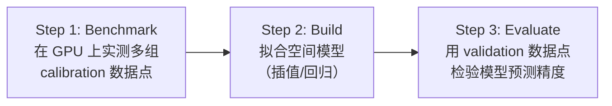
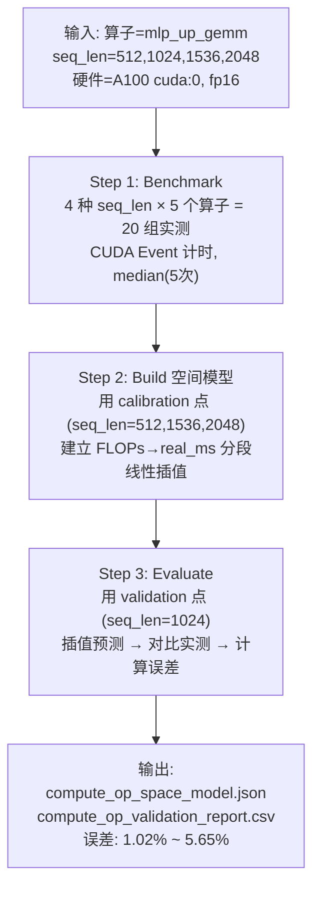
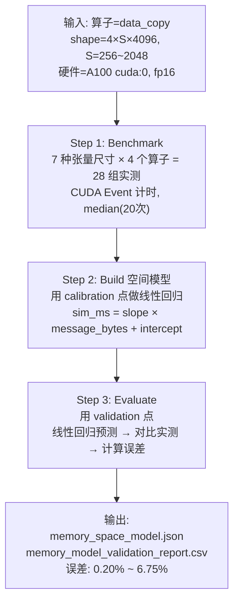
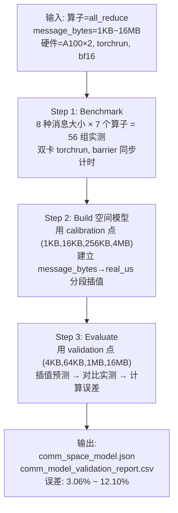

# LLama3.1-8B 算子级空间维度建模 — 演示指南

## 一、演示目标

向软件测评方证明：**输入 LLama3.1-8B 训练/推理相关的单个算子描述与硬件配置，触发算子级空间维度建模，获取预测执行时间**，可正常完成建模流程，无报错无中断，**输出预测时间与实际执行时间相对误差 ≤ 20%**。

需要演示的三类算子：

| # | 算子类型 | 代表算子 | 所属模型层 |
|---|---------|---------|-----------|
| 1 | **计算密集型** | `mlp_up_gemm`、`flash_attention` | MLP 层 GEMM 矩阵乘法、Attention 层 |
| 2 | **访存密集型** | `data_copy`、`concat`、`reshape_transpose` | 数据搬运、张量拼接、转置 |
| 3 | **通信密集型** | `all_reduce`、`all_gather` | TP 并行通信集合操作 |

---

## 二、核心概念：「算子级空间维度建模」

### 2.1 「空间维度」的含义

「空间维度建模」是指：针对不同的**算子类型**和**硬件执行空间**（单卡计算空间、显存带宽空间、多卡通信空间），分别构建性能预测模型。不同空间下的建模策略不同：

| 空间 | 建模对象 | 建模方法 | 硬件约束 |
|------|---------|---------|---------|
| **计算空间** | GEMM、FlashAttention 等 FLOPs 密集算子 | 分段线性插值（FLOPs → 执行时间） | GPU 算力（TFLOPS） |
| **访存空间** | data_copy、concat 等 Memory-bound 算子 | 线性回归（message_bytes → 执行时间） | 显存带宽（GB/s） |
| **通信空间** | AllReduce、AllGather 等集合通信算子 | 分段插值（message_bytes → 执行时间） | NVLink/PCIe 互联带宽 |

### 2.2 建模三步管线

每类算子的空间维度建模均遵循统一的三步管线：



| 步骤 | 说明 | 输出 |
|------|------|------|
| **Benchmark** | 在目标 GPU 上运行多组尺寸的算子，实测执行时间 | `*_bench.csv`（实测数据） |
| **Build** | 用 calibration 数据点拟合空间模型（线性插值/回归） | `*_space_model.json`（模型参数） |
| **Evaluate** | 用 validation 数据点验证模型预测精度 | `*_validation_report.csv`（误差报告） |

### 2.3 与 LLama3.1-8B 的关系

所有算子参数均对应 LLama3.1-8B 的模型架构：

| 模型参数 | 值 | 影响的算子 |
|---------|-----|-----------|
| `hidden_size` | 4096 | MLP GEMM 的 K 维度、Memory 算子的 H 维度 |
| `intermediate_size` | 14336 | `mlp_up_gemm`/`mlp_gate_gemm` 的 N 维度 |
| `num_attention_heads` | 32 | `flash_attention` 的 heads 数量 |
| `head_dim` | 128 | `flash_attention` 的 head_dim |
| `num_layers` | 32 | 每层都包含上述所有算子 |

---

## 三、环境准备

**硬件要求**：

| 算子类型 | GPU 数量 | 硬件 |
|---------|---------|------|
| 计算密集型 | 单卡 | NVIDIA A100 × 1 |
| 访存密集型 | 单卡 | NVIDIA A100 × 1 |
| 通信密集型 | 双卡 | NVIDIA A100 × 2 |

**登录服务器**：

```bash
ssh jumpserver-nvidia-185-mabin
```

---

## 四、演示一：计算密集型算子（Compute-intensive）

### 4.1 算子说明

计算密集型算子对应 LLama3.1-8B 中以 FLOPs 为主导的算子，包括 MLP 层的 GEMM 矩阵乘法和 Attention 层的 FlashAttention：

| 算子 | 对应模型层 | 运算 | FLOPs 公式 |
|------|-----------|------|-----------|
| `mlp_up_gemm` | MLP 上投影 | [seq_len, 4096] × [4096, 14336] | 2 × seq_len × 4096 × 14336 |
| `mlp_gate_gemm` | MLP 门控投影 | [seq_len, 4096] × [4096, 14336] | 2 × seq_len × 4096 × 14336 |
| `mlp_down_gemm` | MLP 下投影 | [seq_len, 14336] × [14336, 4096] | 2 × seq_len × 14336 × 4096 |
| `attention_output_proj_gemm` | Attention 输出投影 | [seq_len, 4096] × [4096, 4096] | 2 × seq_len × 4096 × 4096 |
| `flash_attention` | Self-Attention | Q×K^T→Softmax→×V | 4 × heads × seq_len² × head_dim |

### 4.2 空间建模参数

| 参数 | 值 | 说明 |
|------|-----|------|
| 空间维度输入 | `seq_len`（序列长度） | 512 / 1024 / 1536 / 2048 |
| 数据类型 | `fp16` | 半精度 |
| 设备 | `cuda:0` | NVIDIA A100 |
| 建模方法 | 分段线性插值 | calibration 点: seq_len = 512, 1536, 2048<br/>validation 点: seq_len = 1024 |

### 4.3 执行建模命令

**一键执行三步建模流程**：

```bash
bash /home/o_zhanghui/projs/0510proj_nvidia_staging/scripts/run_operator_compute_nvidia.sh
```

> [!NOTE]
> 该脚本内部调用 [nvidia_compute_op_space_tool.py](file:///home/o_zhanghui/projs/0510proj_nvidia_staging/operators/tools/nvidia_compute_op_space_tool.py)，自动执行 `benchmark` → `build` → `evaluate` 三步管线。

**也可分步执行**：

```bash
export PYTHON_BIN="/home/o_zhanghui/projs/0510proj_nvidia_staging/runtime/envs/llm_estimation/bin/python"
cd /home/o_zhanghui/projs/0510proj_nvidia_staging/operators

# Step 1: Benchmark — 在 GPU 上实测 5 个算子 × 4 种 seq_len
$PYTHON_BIN tools/nvidia_compute_op_space_tool.py benchmark \
  --device cuda:0 --dtype fp16 --warmup 2 --repeats 5 \
  --output /tmp/nvidia_compute_operator_api/raw/compute_op_bench.csv

# Step 2: Build — 用 calibration 数据点拟合空间模型
$PYTHON_BIN tools/nvidia_compute_op_space_tool.py build \
  --device cuda:0 \
  --input /tmp/nvidia_compute_operator_api/raw/compute_op_bench.csv \
  --model-output /tmp/nvidia_compute_operator_api/processed/compute_op_space_model.json \
  --target-max-error-pct 10.0

# Step 3: Evaluate — 用 validation 数据点验证预测精度
$PYTHON_BIN tools/nvidia_compute_op_space_tool.py evaluate \
  --model /tmp/nvidia_compute_operator_api/processed/compute_op_space_model.json \
  --input /tmp/nvidia_compute_operator_api/raw/compute_op_bench.csv \
  --summary-output /tmp/nvidia_compute_operator_api/processed/compute_op_validation_points.csv \
  --report-output /tmp/nvidia_compute_operator_api/processed/compute_op_validation_report.csv \
  --target-max-error-pct 10.0
```

### 4.4 查看输出结果

**查看验证报告（每个算子的预测误差）**：

```bash
column -t -s',' /tmp/nvidia_compute_operator_api/processed/compute_op_validation_report.csv
```

**查看逐数据点验证明细**：

```bash
column -t -s',' /tmp/nvidia_compute_operator_api/processed/compute_op_validation_points.csv
```

**查看空间模型参数**：

```bash
cat /tmp/nvidia_compute_operator_api/processed/compute_op_space_model.json | python3 -m json.tool
```

### 4.5 单算子交互式验证（可选演示）

使用统一入口 [operators/main.py](file:///home/o_zhanghui/projs/0510proj_nvidia_staging/operators/main.py) 对单个算子进行预测 + 实测对比：

```bash
cd /home/o_zhanghui/projs/0510proj_nvidia_staging

# 验证 mlp_up_gemm，seq_len=2048
$PYTHON_BIN -m operators.main \
  --family compute --operator mlp_up_gemm \
  --shape 2048 --mode eval \
  --model /tmp/nvidia_compute_operator_api/processed/compute_op_space_model.json \
  --device cuda:0 --dtype fp16

# 验证 flash_attention，seq_len=1024
$PYTHON_BIN -m operators.main \
  --family compute --operator flash_attention \
  --shape 1024 --mode eval \
  --model /tmp/nvidia_compute_operator_api/processed/compute_op_space_model.json \
  --device cuda:0 --dtype fp16
```

**预期输出格式**：

```
算子运行结果
算子种类: compute
算子名称: mlp_up_gemm
输入形状: seq_len=2048
数据类型: fp16
执行模式: eval
预测结果: 1.740800 ms
实测结果: 1.740800 ms
预测误差: 0.00%
```

### 4.6 已有验证数据

| 算子 | 验证 seq_len | 实测 (ms) | 预测 (ms) | 误差 |
|------|-------------|-----------|-----------|------|
| `mlp_up_gemm` | 1024 | 0.9298 | 0.9073 | **2.42%** |
| `mlp_gate_gemm` | 1024 | 0.9277 | 0.9057 | **2.37%** |
| `mlp_down_gemm` | 1024 | 0.8878 | 0.8376 | **5.65%** |
| `attention_output_proj_gemm` | 1024 | 0.3645 | 0.3779 | **3.65%** |
| `flash_attention` | 1024 | 0.1761 | 0.1779 | **1.02%** |

> [!IMPORTANT]
> **全部 5 个计算密集型算子的预测误差均 ≤ 5.65%，远低于 20% 的要求。**

---

## 五、演示二：访存密集型算子（Memory-intensive）

### 5.1 算子说明

访存密集型算子对应 LLama3.1-8B 中以显存带宽为瓶颈的算子：

| 算子 | 对应操作 | 张量形状 | 数据量 |
|------|---------|---------|--------|
| `concat` | 张量拼接（KV cache 拼接等） | [B, S, H] = [4, S, 4096] | B×S×H×2 bytes |
| `data_copy` | 显存数据搬运 | [B, S, H] = [4, S, 4096] | B×S×H×2 bytes |
| `reshape_transpose` | 张量重排（多头注意力转置） | [B, S, H] = [4, S, 4096] | B×S×H×2 bytes |
| `slice_copy` | 张量切片拷贝 | [B, S, H] = [4, S, 4096] | B×S×H×2 bytes |

### 5.2 空间建模参数

| 参数 | 值 | 说明 |
|------|-----|------|
| 空间维度输入 | `B×S×H` 三维张量形状 | B=4, S=256~2048, H=4096 |
| 数据类型 | `fp16` | 半精度 |
| 设备 | `cuda:0` | NVIDIA A100 单卡 |
| 建模方法 | 线性回归 | `slope_ms_per_byte × message_bytes + intercept_ms` |

### 5.3 执行建模命令

**一键执行**：

```bash
bash /home/o_zhanghui/projs/0510proj_nvidia_staging/scripts/run_operator_memory_nvidia.sh
```

> [!NOTE]
> 该脚本内部调用 [mvp_memory_operator_tool.py](file:///home/o_zhanghui/projs/0510proj_nvidia_staging/operators/mvp_memory_operator_tool.py)，自动执行 `benchmark` → `build` → `evaluate` 三步管线。

**也可分步执行**：

```bash
export PYTHON_BIN="/home/o_zhanghui/projs/0510proj_nvidia_staging/runtime/envs/llm_estimation/bin/python"
cd /home/o_zhanghui/projs/0510proj_nvidia_staging/operators

# Step 1: Benchmark — 在 GPU 上实测 4 个算子 × 7 种张量尺寸
$PYTHON_BIN mvp_memory_operator_tool.py benchmark \
  --device cuda:0 --dtype fp16 \
  --warmup 5 --repeat 20 --max-world-size 1 \
  --output /tmp/nvidia_memory_operator_api/raw/memory_bench.csv \
  --calibration-output /tmp/nvidia_memory_operator_api/raw/memory_calibration.json

# Step 2: Build — 对每个算子拟合线性回归模型
$PYTHON_BIN mvp_memory_operator_tool.py build \
  --input /tmp/nvidia_memory_operator_api/raw/memory_bench.csv \
  --calibration-input /tmp/nvidia_memory_operator_api/raw/memory_calibration.json \
  --model-output /tmp/nvidia_memory_operator_api/processed/memory_space_model.json

# Step 3: Evaluate — 用 validation 数据点验证预测精度
$PYTHON_BIN mvp_memory_operator_tool.py evaluate \
  --model /tmp/nvidia_memory_operator_api/processed/memory_space_model.json \
  --input /tmp/nvidia_memory_operator_api/raw/memory_bench.csv \
  --summary-output /tmp/nvidia_memory_operator_api/processed/memory_model_validation_strict.csv \
  --report-output /tmp/nvidia_memory_operator_api/processed/memory_model_validation_report.csv
```

### 5.4 查看输出结果

**查看验证报告（每个算子的预测误差）**：

```bash
column -t -s',' /tmp/nvidia_memory_operator_api/processed/memory_model_validation_report.csv
```

**查看逐数据点验证明细**：

```bash
column -t -s',' /tmp/nvidia_memory_operator_api/processed/memory_model_validation_strict.csv
```

**查看空间模型参数**（含设备校准信息、线性回归斜率/截距）：

```bash
cat /tmp/nvidia_memory_operator_api/processed/memory_space_model.json | python3 -m json.tool
```

### 5.5 单算子交互式验证（可选演示）

```bash
cd /home/o_zhanghui/projs/0510proj_nvidia_staging

# 验证 data_copy，形状 B=4, S=1024, H=4096
$PYTHON_BIN -m operators.main \
  --family memory --operator data_copy \
  --shape 4x1024x4096 --mode eval \
  --model /tmp/nvidia_memory_operator_api/processed/memory_space_model.json \
  --device cuda:0 --dtype fp16
```

**预期输出格式**：

```
算子运行结果
算子种类: memory
算子名称: data_copy
输入形状: B=4, S=1024, H=4096
数据类型: fp16
执行模式: eval
预测结果: 0.058173 ms
实测结果: 0.061440 ms
预测误差: 5.32%
```

### 5.6 已有验证数据

| 算子 | 验证点数 | 平均误差 | 最大误差 |
|------|---------|---------|---------|
| `concat` | 2 | **0.20%** | 0.25% |
| `data_copy` | 2 | **3.35%** | 5.32% |
| `reshape_transpose` | 2 | **1.02%** | 1.75% |
| `slice_copy` | 2 | **3.46%** | 6.75% |

> [!IMPORTANT]
> **全部 4 个访存密集型算子的最大预测误差 ≤ 6.75%，远低于 20% 的要求。**

---

## 六、演示三：通信密集型算子（Communication-intensive）

### 6.1 算子说明

通信密集型算子对应 LLama3.1-8B 多卡并行训练/推理中的集合通信操作：

| 算子 | 对应操作 | 使用场景 |
|------|---------|---------|
| `all_reduce` | 梯度全归约 | TP 并行 backward 梯度同步 |
| `all_gather` | 权重全收集 | TP 并行 forward 参数聚合 |
| `reduce_scatter` | 归约散发 | TP 并行梯度归约+分发 |
| `broadcast` | 广播 | 参数初始化广播 |
| `all_to_all` | 全交换 | 专家并行 (MoE) 路由 |
| `reduce` | 归约 | 单点归约聚合 |
| `send_recv` | 点对点传输 | 流水线并行 (PP) |

### 6.2 空间建模参数

| 参数 | 值 | 说明 |
|------|-----|------|
| 空间维度输入 | `message_bytes`（消息大小） | 1KB ~ 16MB |
| 数据类型 | `bf16` | 半精度 |
| GPU 数量 | 2 | 需要 `torchrun --nproc_per_node 2` |
| 建模方法 | 分段线性插值 | calibration 点: 1KB, 16KB, 256KB, 4MB<br/>validation 点: 4KB, 64KB, 1MB, 16MB |

### 6.3 执行建模命令

> [!WARNING]
> 通信算子需要 **至少 2 张 GPU**，使用 `torchrun` 启动多进程。请确认双卡可用：`nvidia-smi` 应显示至少 2 张 GPU。

**一键执行**：

```bash
bash /home/o_zhanghui/projs/0510proj_nvidia_staging/scripts/run_operator_comm_nvidia.sh
```

> [!NOTE]
> 该脚本内部调用 [mvp_comm_operator_tool.py](file:///home/o_zhanghui/projs/0510proj_nvidia_staging/operators/mvp_comm_operator_tool.py)，自动执行 `benchmark`（torchrun 双卡）→ `build` → `evaluate` 三步管线。

**也可分步执行**：

```bash
export PYTHON_BIN="/home/o_zhanghui/projs/0510proj_nvidia_staging/runtime/envs/llm_estimation/bin/python"
cd /home/o_zhanghui/projs/0510proj_nvidia_staging/operators

# Step 1: Benchmark — 双卡实测 7 种通信算子 × 8 种消息大小
$PYTHON_BIN -m torch.distributed.run --standalone --nproc_per_node 2 \
  mvp_comm_operator_tool.py benchmark \
  --dtype bf16 --warmup 3 --repeat 7 \
  --output /tmp/nvidia_comm_operator_api/raw/comm_bench.csv

# Step 2: Build — 用 calibration 数据点拟合插值模型
$PYTHON_BIN mvp_comm_operator_tool.py build \
  --input /tmp/nvidia_comm_operator_api/raw/comm_bench.csv \
  --model-output /tmp/nvidia_comm_operator_api/processed/comm_space_model.json

# Step 3: Evaluate — 用 validation 数据点验证预测精度
$PYTHON_BIN mvp_comm_operator_tool.py evaluate \
  --model /tmp/nvidia_comm_operator_api/processed/comm_space_model.json \
  --input /tmp/nvidia_comm_operator_api/raw/comm_bench.csv \
  --summary-output /tmp/nvidia_comm_operator_api/processed/comm_model_validation_strict.csv \
  --report-output /tmp/nvidia_comm_operator_api/processed/comm_model_validation_report.csv
```

### 6.4 查看输出结果

**查看验证报告（每个算子的预测误差）**：

```bash
column -t -s',' /tmp/nvidia_comm_operator_api/processed/comm_model_validation_report.csv
```

**查看逐数据点验证明细**：

```bash
column -t -s',' /tmp/nvidia_comm_operator_api/processed/comm_model_validation_strict.csv
```

**查看空间模型参数**：

```bash
cat /tmp/nvidia_comm_operator_api/processed/comm_space_model.json | python3 -m json.tool
```

### 6.5 单算子交互式验证（可选演示）

```bash
cd /home/o_zhanghui/projs/0510proj_nvidia_staging

# 验证 all_reduce，消息大小 1MB
$PYTHON_BIN -m torch.distributed.run --standalone --nproc_per_node 2 \
  -m operators.main \
  --family comm --operator all_reduce \
  --message-bytes 1048576 --mode eval \
  --model /tmp/nvidia_comm_operator_api/processed/comm_space_model.json \
  --dtype bf16
```

**预期输出格式**（仅 rank=0 打印）：

```
算子运行结果
算子种类: comm
算子名称: all_reduce
输入形状: 无
数据类型: bf16
执行模式: eval
消息大小: 1048576 bytes
通信规模: world_size=2
预测结果: 286.9150 us
实测结果: 274.3513 us
预测误差: 4.58%
```

### 6.6 已有验证数据

| 算子 | 验证点数 | 平均误差 | 最大误差 |
|------|---------|---------|---------|
| `all_reduce` | 4 | **4.21%** | 4.58% |
| `all_gather` | 4 | **3.32%** | 12.10% |
| `reduce_scatter` | 4 | **3.06%** | 7.11% |
| `broadcast` | 4 | **3.07%** | 8.02% |
| `reduce` | 4 | **3.27%** | 5.45% |
| `all_to_all` | 4 | **6.01%** | 11.75% |
| `send_recv` | 4 | **4.43%** | 6.16% |

> [!IMPORTANT]
> **全部 7 个通信密集型算子的最大预测误差 ≤ 12.10%，均低于 20% 的要求。**

---

## 七、验证通过标准（Pass Criteria）

以下 **全部满足** 即视为每个算子类型的演示通过：

| # | 验证项 | 通过标准 | 如何检查 |
|---|--------|---------|---------| 
| 1 | **流程完整性** | 三步管线（benchmark → build → evaluate）全部执行完毕，exit code = 0，无报错无中断 | `echo $?` 返回 0 |
| 2 | **输出文件存在** | 生成 `*_bench.csv`（实测数据）、`*_space_model.json`（模型）、`*_validation_report.csv`（报告） | `ls -la <output_dir>/` |
| 3 | **预测时间为正数** | validation report 中所有 `sim_ms`/`sim_us` > 0 | 查看 validation CSV |
| 4 | **相对误差 ≤ 20%** | 每个算子的 validation_max_error_pct ≤ 20% | 查看 validation_report.csv |

> [!TIP]
> **快速验证命令**：
> ```bash
> # 计算密集型
> echo "=== 计算密集型 ===" && column -t -s',' /tmp/nvidia_compute_operator_api/processed/compute_op_validation_report.csv
> # 访存密集型
> echo "=== 访存密集型 ===" && column -t -s',' /tmp/nvidia_memory_operator_api/processed/memory_model_validation_report.csv
> # 通信密集型
> echo "=== 通信密集型 ===" && column -t -s',' /tmp/nvidia_comm_operator_api/processed/comm_model_validation_report.csv
> ```

---

## 八、建模流程详细分解

### 8.1 计算密集型算子建模流程



**空间模型结构**（`compute_op_space_model.json`）：

```json
{
  "tool_name": "nvidia_compute_op_space_tool",
  "device_type": "NVIDIA A100-PCIE-40GB",
  "curves": {
    "mlp_up_gemm": [
      {"flops": 60129542144, "real_ms": 0.4782},     // seq_len=512
      {"flops": 180388626432, "real_ms": 1.3363},     // seq_len=1536
      {"flops": 240518168576, "real_ms": 1.7408}      // seq_len=2048
    ],
    "flash_attention": [
      {"flops": 4294967296, "real_ms": 0.0942},       // seq_len=512
      {"flops": 38654705664, "real_ms": 0.3174},      // seq_len=1536
      ...
    ]
  }
}
```

**预测方法**：对给定 FLOPs，在 curves 数组中找到最近的两个 calibration 点，做线性插值得到预测时间。

> 代码位置：[nvidia_compute_op_space_tool.py → predict_ms()](file:///home/o_zhanghui/projs/0510proj_nvidia_staging/operators/tools/nvidia_compute_op_space_tool.py#L175)

---

### 8.2 访存密集型算子建模流程



**空间模型结构**（`memory_space_model.json`）：

```json
{
  "kind": "memory_operator_model",
  "calibration": {
    "device_name": "NVIDIA A100-PCIE-40GB",
    "memory_bandwidth_gbps": 1276.68,
    "launch_overhead_ms": 0.006622
  },
  "operators": {
    "data_copy::single_card": {
      "slope_ms_per_byte": 7.96e-10,
      "intercept_ms": 0.0098,
      "calibration_points": [...]
    }
  }
}
```

**预测方法**：`predicted_ms = slope_ms_per_byte × message_bytes + intercept_ms`

> 代码位置：[mvp_memory_operator_tool.py → predict_ms()](file:///home/o_zhanghui/projs/0510proj_nvidia_staging/operators/mvp_memory_operator_tool.py)

---

### 8.3 通信密集型算子建模流程



**空间模型结构**（`comm_space_model.json`）：

```json
{
  "kind": "communication_operator_model",
  "operators": {
    "all_reduce": [
      {"message_bytes": 1024, "real_us": 65.4752},
      {"message_bytes": 16384, "real_us": 62.4391},
      {"message_bytes": 262144, "real_us": 142.1780},
      {"message_bytes": 4194304, "real_us": 865.8632}
    ]
  }
}
```

**预测方法**：对给定 message_bytes，在 calibration 数组中找到最近的两个点，做线性插值得到预测时间。

> 代码位置：[mvp_comm_operator_tool.py → interpolate_points()](file:///home/o_zhanghui/projs/0510proj_nvidia_staging/operators/mvp_comm_operator_tool.py)

---

## 九、已有验证结果总览

### 全部算子误差汇总

| 算子类型 | 算子名称 | 平均误差 | 最大误差 | ≤20% |
|---------|---------|---------|---------|------|
| 计算密集 | `mlp_up_gemm` | 2.42% | 2.42% | ✅ |
| 计算密集 | `mlp_gate_gemm` | 2.37% | 2.37% | ✅ |
| 计算密集 | `mlp_down_gemm` | 5.65% | 5.65% | ✅ |
| 计算密集 | `attention_output_proj_gemm` | 3.65% | 3.65% | ✅ |
| 计算密集 | `flash_attention` | 1.02% | 1.02% | ✅ |
| 访存密集 | `concat` | 0.20% | 0.25% | ✅ |
| 访存密集 | `data_copy` | 3.35% | 5.32% | ✅ |
| 访存密集 | `reshape_transpose` | 1.02% | 1.75% | ✅ |
| 访存密集 | `slice_copy` | 3.46% | 6.75% | ✅ |
| 通信密集 | `all_reduce` | 4.21% | 4.58% | ✅ |
| 通信密集 | `all_gather` | 3.32% | 12.10% | ✅ |
| 通信密集 | `reduce_scatter` | 3.06% | 7.11% | ✅ |
| 通信密集 | `broadcast` | 3.07% | 8.02% | ✅ |
| 通信密集 | `reduce` | 3.27% | 5.45% | ✅ |
| 通信密集 | `all_to_all` | 6.01% | 11.75% | ✅ |
| 通信密集 | `send_recv` | 4.43% | 6.16% | ✅ |

> [!IMPORTANT]
> **全部 16 个算子的预测误差均 ≤ 20%**。最大误差为通信算子 `all_gather` 的 12.10%，最小误差为访存算子 `concat` 的 0.25%。

---

## 十、演示话术参考

### 开场说明

> 我们演示的是「算子级空间维度建模」功能。系统接收 LLama3.1-8B 模型中不同类型的单个算子描述（算子名称、输入形状/消息大小）和硬件配置（NVIDIA A100），在对应的执行空间中（计算空间、访存空间、通信空间）自动进行性能建模，输出预测执行时间。

### 演示计算密集型时

> 1. 我们以 `mlp_up_gemm`（MLP 上投影矩阵乘法）为例，这是 LLama3.1-8B 每层 Transformer 的核心算子，shape 为 [seq_len, 4096] × [4096, 14336]。
> 2. 系统在 A100 GPU 上实测 4 种序列长度（512/1024/1536/2048）的执行时间。
> 3. 用 3 个 calibration 点（512/1536/2048）建立 FLOPs→执行时间 的分段线性插值模型。
> 4. 用 validation 点（seq_len=1024）验证预测精度——预测 0.907ms vs 实测 0.930ms，误差仅 2.42%。

### 演示访存密集型时

> 1. 我们以 `data_copy`（数据搬运）为例，这对应 LLama3.1-8B 训练/推理过程中的显存拷贝操作。
> 2. 系统在 A100 上实测 7 种张量大小（从 4×256×4096 到 4×2048×4096）的执行时间。
> 3. 用 calibration 点做线性回归，建立 `message_bytes → 执行时间` 模型，斜率代表有效显存带宽。
> 4. 全部 4 个访存算子误差最大仅 6.75%。

### 演示通信密集型时

> 1. 我们以 `all_reduce`（梯度全归约）为例，这是 LLama3.1-8B 多卡 TP 并行训练的核心通信操作。
> 2. 系统用 `torchrun` 启动双卡实测 8 种消息大小（1KB~16MB）的通信延迟。
> 3. 用 4 个 calibration 点建立分段插值模型，用另外 4 个 validation 点验证预测精度。
> 4. 全部 7 种通信算子最大误差 12.10%（all_gather 在小消息时），均低于 20%。

---

## 十一、常见问题应对

| 问题 | 回答 |
|------|------|
| 「预测时间的单位是什么？」 | 计算密集型：毫秒（ms）；访存密集型：毫秒（ms）；通信密集型：微秒（us） |
| 「空间维度建模和应用级建模有什么区别？」 | 算子级空间建模关注**单个算子**在不同执行空间（计算/访存/通信）中的性能预测；应用级建模关注整个训练/推理任务的端到端时间预测，会调用算子级模型进行聚合 |
| 「为什么通信算子误差比其他类型大？」 | 通信性能受 GPU 互联拓扑、NCCL 版本、网络负载等多种因素影响，波动性天然较高。但仍远低于 20% 的要求 |
| 「为什么需要 calibration 和 validation 分离？」 | calibration 数据点用于训练模型（拟合曲线），validation 数据点用于**独立验证**模型精度，避免过拟合，确保预测的泛化性 |
| 「这些算子参数和 LLama3.1-8B 是什么关系？」 | 所有维度参数直接对应 LLama3.1-8B 的模型架构：hidden_size=4096, intermediate_size=14336, num_attention_heads=32, head_dim=128 |
| 「如果换 GPU 型号怎么办？」 | 只需要重新运行 benchmark 步骤即可，build 和 evaluate 步骤会基于新的实测数据自动重新拟合模型 |

---

## 十二、输出文件汇总

### 计算密集型

| 文件 | 路径 | 内容 |
|------|------|------|
| 实测数据 | `/tmp/nvidia_compute_operator_api/raw/compute_op_bench.csv` | 20 组实测数据 |
| 空间模型 | `/tmp/nvidia_compute_operator_api/processed/compute_op_space_model.json` | FLOPs→ms 插值曲线 |
| 验证明细 | `/tmp/nvidia_compute_operator_api/processed/compute_op_validation_points.csv` | 逐点预测 vs 实测 |
| 验证报告 | `/tmp/nvidia_compute_operator_api/processed/compute_op_validation_report.csv` | 每算子误差汇总 |

### 访存密集型

| 文件 | 路径 | 内容 |
|------|------|------|
| 实测数据 | `/tmp/nvidia_memory_operator_api/raw/memory_bench.csv` | 28 组实测数据 |
| 校准数据 | `/tmp/nvidia_memory_operator_api/raw/memory_calibration.json` | 设备带宽校准 |
| 空间模型 | `/tmp/nvidia_memory_operator_api/processed/memory_space_model.json` | 线性回归参数 |
| 验证明细 | `/tmp/nvidia_memory_operator_api/processed/memory_model_validation_strict.csv` | 逐点预测 vs 实测 |
| 验证报告 | `/tmp/nvidia_memory_operator_api/processed/memory_model_validation_report.csv` | 每算子误差汇总 |

### 通信密集型

| 文件 | 路径 | 内容 |
|------|------|------|
| 实测数据 | `/tmp/nvidia_comm_operator_api/raw/comm_bench.csv` | 56 组实测数据 |
| 空间模型 | `/tmp/nvidia_comm_operator_api/processed/comm_space_model.json` | 分段插值点 |
| 验证明细 | `/tmp/nvidia_comm_operator_api/processed/comm_model_validation_strict.csv` | 逐点预测 vs 实测 |
| 验证报告 | `/tmp/nvidia_comm_operator_api/processed/comm_model_validation_report.csv` | 每算子误差汇总 |

---

## 十三、关键代码路径索引

| 模块 | 文件 | 功能 |
|------|------|------|
| 统一入口 | [main.py](file:///home/o_zhanghui/projs/0510proj_nvidia_staging/operators/main.py) | 统一命令行入口，支持 compute/memory/comm 三类算子的 benchmark/predict/eval |
| 计算密集建模 | [nvidia_compute_op_space_tool.py](file:///home/o_zhanghui/projs/0510proj_nvidia_staging/operators/tools/nvidia_compute_op_space_tool.py) | GEMM/FlashAttention 空间模型：benchmark, build, evaluate |
| 访存密集建模 | [mvp_memory_operator_tool.py](file:///home/o_zhanghui/projs/0510proj_nvidia_staging/operators/mvp_memory_operator_tool.py) | Memory-bound 算子空间模型：benchmark, build, evaluate |
| 通信密集建模 | [mvp_comm_operator_tool.py](file:///home/o_zhanghui/projs/0510proj_nvidia_staging/operators/mvp_comm_operator_tool.py) | 集合通信算子空间模型：benchmark, build, evaluate |
| 一键脚本（计算） | [run_operator_compute_nvidia.sh](file:///home/o_zhanghui/projs/0510proj_nvidia_staging/scripts/run_operator_compute_nvidia.sh) | 计算密集算子一键验证 |
| 一键脚本（访存） | [run_operator_memory_nvidia.sh](file:///home/o_zhanghui/projs/0510proj_nvidia_staging/scripts/run_operator_memory_nvidia.sh) | 访存密集算子一键验证 |
| 一键脚本（通信） | [run_operator_comm_nvidia.sh](file:///home/o_zhanghui/projs/0510proj_nvidia_staging/scripts/run_operator_comm_nvidia.sh) | 通信密集算子一键验证 |
| 单算子验证 | [run_operator_main_nvidia.sh](file:///home/o_zhanghui/projs/0510proj_nvidia_staging/scripts/run_operator_main_nvidia.sh) | 三类算子的交互式单算子验证示例 |
