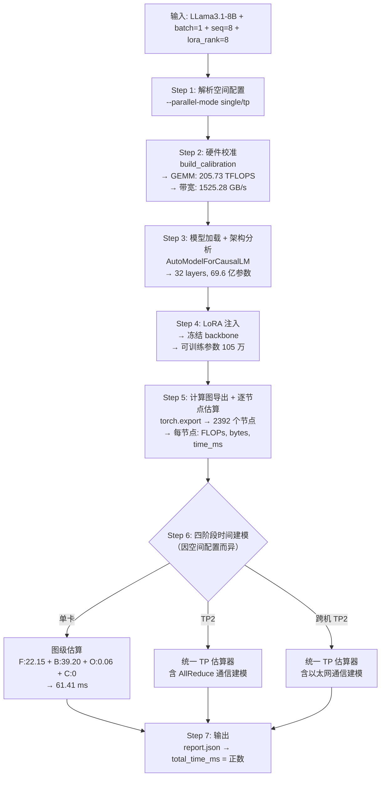

# LLama3.1-8B 训练任务 — 应用级时空双维度建模演示指南

## 一、演示目标

向软件测评方证明：**输入 LLama3.1-8B 训练任务完整描述与硬件配置，触发应用级时空双维度建模，获取任务预测执行时间**，可正常完成建模流程，无报错无中断，直接输出符合格式要求的正数预测执行时间。

---

## 二、核心概念：「时空双维度建模」

本系统的「应用级时空双维度建模」体现在以下两个维度：

| 维度 | 含义 | 当前已实现 | 在代码中的体现 |
|------|------|-----------|---------------|
| **空间维度（Space）** | 不同并行部署方式下的分布式拓扑建模：系统针对不同的空间并行配置（单卡、单机多卡 TP、跨机多卡 TP）分别构建性能预测模型，覆盖计算、通信、同步等差异化开销 | ① 单卡（single）<br>② 单机 TP2（single_node_multi_device）<br>③ 跨机 TP2（multi_node） | [mvp_train_app.py](file:///home/o_zhanghui/projs/0510proj_nvidia_staging/training/lora_seq8_current/source_185_single/mvp_train_app.py) 中 `--parallel-mode single/tp`、`resolve_train_execution_config()` 根据空间配置选择不同的估算路径 |
| **时间维度（Time）** | 端到端训练 step 时间预测：将 forward + backward + optimizer + communication 四阶段时间叠加，经硬件校准（calibration）后输出 `total_time_ms` | forward → backward → optimizer → communication 四阶段流水线建模 | [mvp_train_app.py](file:///home/o_zhanghui/projs/0510proj_nvidia_staging/training/lora_seq8_current/source_185_single/mvp_train_app.py) 中 `build_train_estimate_report()` 最终输出 `estimate.per_step.total_time_ms` |

> [!NOTE]
> **空间建模**：系统支持三种并行部署拓扑的性能建模——**单卡**（无通信开销）、**单机 TP2**（NVLink/PCIe 卡间通信）、**跨机 TP2**（以太网/InfiniBand 节点间通信）。不同空间配置下，计算图分片、通信集合（AllReduce/AllGather）、同步开销的建模策略各不相同。
> **时间建模**：在给定的空间并行配置下，将模型计算图中的逐节点时间聚合为 forward → backward → optimizer → communication 四阶段流水线时间，结合硬件校准参数（GEMM TFLOPS、显存带宽等），输出单 step 预测执行时间。

> [!TIP]
> **扩展规划**：空间维度后续将扩充更多并行方式，如 DDP（数据并行）、PP（流水线并行）、TP+DDP 混合并行、TP+PP 混合并行等，以覆盖更丰富的分布式训练部署场景。

### 空间维度参数选项

空间维度通过以下命令行参数组合控制：

| 空间配置 | `--parallel-mode` | `--tp-size` | `--world-size` | `--nnodes` | 启动方式 | 通信类型 |
|---------|-------------------|-------------|----------------|------------|---------|---------|
| ① 单卡 | `single` | 1 | 1 | 1 | `python` 直接运行 | 无通信 |
| ② 单机 TP2 | `tp` | 2 | 2 | 1 | `torchrun --standalone --nproc_per_node 2` | NVLink/PCIe AllReduce |
| ③ 跨机 TP2 | `tp` | 2 | 2 | 2 | 两台机器各运行 `torchrun --nnodes 2 --node_rank 0/1` | 以太网/InfiniBand AllReduce |

---

## 三、演示输入参数说明

### 3.1 任务描述输入

| 参数 | 值 | 说明 |
|------|-----|------|
| **模型** | LLama-3.1-8B | 模型参数量 ~7B（6,956,777,472） |
| **任务类型** | LoRA 微调训练 | `--lora-rank 8`，backbone 冻结，仅 adapter 可训练 |
| **batch_size** | 1 | 单样本 |
| **seq_len** | 8 | 序列长度 8 tokens |
| **精度** | bf16 | 半精度训练 |
| **优化器** | AdamW（隐式） | 通过 config 配置 |

### 3.2 硬件配置输入

| 参数 | 值 | 说明 |
|------|-----|------|
| **GPU 型号** | NVIDIA A100 80GB PCIe | 系统自动校准探测 |
| **GEMM 算力** | ~205.73 TFLOPS | 通过 `build_calibration()` 实测 |
| **显存带宽** | ~1525.28 GB/s | 通过 `build_calibration()` 实测 |
| **并行模式** | single / tp / multi_node | 可选单卡/多卡/跨机 |

---

## 四、演示操作步骤

### 方式一：单卡训练预测（推荐首选演示）

> [!IMPORTANT]
> 此方式最简单直观，在单台 NVIDIA A100 机器上即可完成，适合现场演示。

**Step 1：SSH 登录并执行训练预测命令**

```bash
ssh jumpserver-nvidia-185-mabin

source /home/o_mabin/miniconda3/etc/profile.d/conda.sh && conda activate llm_estimation
cd /home/o_mabin/projects/llm-gzc/train-infer-estimation
cp config/train_config.yaml /tmp/train_lora_seq8_single.yaml

CUDA_VISIBLE_DEVICES=1 TRAIN_CONFIG_PATH=/tmp/train_lora_seq8_single.yaml \
  python mvp_train_app.py \
  --model-path /home/o_mabin/projects/llm/models/Llama-3.1-8B \
  --parallel-mode single \
  --batch-size 1 --seq-len 8 \
  --lora-rank 8 \
  --warmup 1 --repeat 3 \
  --output-dir reports/train_lora_seq8_single
```

**Step 2：查看输出结果**

```bash
# 1. 确认输出文件完整
ls -la reports/train_lora_seq8_single/
# 预期输出: report.json  report.md  dashboard_status.json  adapter_checkpoint.pt

# 2. 查看预测执行时间（关键结果）
python3 -c "
import json
with open('reports/train_lora_seq8_single/report.json') as f:
    r = json.load(f)
print('=== 训练预测结果 ===')
print(f'Forward  预测时间: {r[\"estimate\"][\"per_step\"][\"forward_time_ms\"]:.4f} ms')
print(f'Backward 预测时间: {r[\"estimate\"][\"per_step\"][\"backward_time_ms\"]:.4f} ms')
print(f'Optimizer预测时间: {r[\"estimate\"][\"per_step\"][\"optimizer_time_ms\"]:.4f} ms')
print(f'Total    预测时间: {r[\"estimate\"][\"per_step\"][\"total_time_ms\"]:.4f} ms')
print(f'设备:             {r[\"calibration\"][\"device_name\"]}')
print(f'并行模式:          {r[\"execution\"][\"parallel_mode\"]}')
print()
print('=== 预测 vs 实测对比 ===')
print(f'Forward:  预测 {r[\"estimate\"][\"per_step\"][\"forward_time_ms\"]:.2f} vs 实测 {r[\"measured\"][\"forward\"][\"mean_ms\"]:.2f} ms, 误差 {r[\"comparison\"][\"forward_error_pct\"]:.2f}%')
print(f'Backward: 预测 {r[\"estimate\"][\"per_step\"][\"backward_time_ms\"]:.2f} vs 实测 {r[\"measured\"][\"backward_compute\"][\"mean_ms\"]:.2f} ms, 误差 {r[\"comparison\"][\"backward_error_pct\"]:.2f}%')
print(f'Total:    预测 {r[\"estimate\"][\"per_step\"][\"total_time_ms\"]:.2f} vs 实测 {r[\"measured\"][\"forward_backward_optimizer\"][\"mean_ms\"]:.2f} ms, 误差 {r[\"comparison\"][\"total_relative_error_pct\"]:.2f}%')
"

# 3. 查看人类可读摘要
cat reports/train_lora_seq8_single/report.md
```

---

### 方式二：单机双卡 TP2 训练预测

**Step 1：SSH 登录并执行训练预测命令**

```bash
ssh jumpserver-nvidia-107-mabin

source /home/o_mabin/miniconda/etc/profile.d/conda.sh && conda activate llm_estimation
cd /home/o_mabin/projects/llm_estimation
cp config/train_config.yaml /tmp/train_lora_seq8_tp.yaml

CUDA_VISIBLE_DEVICES=2,3 TRAIN_CONFIG_PATH=/tmp/train_lora_seq8_tp.yaml \
  torchrun --nproc_per_node=2 mvp_train_app.py \
  --model-path /home/o_mabin/projects/llm/models/Llama-3.1-8B \
  --parallel-mode tp --tp-size 2 --world-size 2 \
  --batch-size 1 --seq-len 8 \
  --lora-rank 8 --warmup 1 --repeat 3 \
  --output-dir /tmp/train_lora_seq8_tp2
```

**Step 2：查看输出结果**

```bash
# 1. 确认输出文件完整
ls -la /tmp/train_lora_seq8_tp2/

# 2. 查看预测执行时间
python3 -c "
import json
with open('/tmp/train_lora_seq8_tp2/report.json') as f:
    r = json.load(f)
print('=== TP2 训练预测结果 ===')
print(f'Forward  预测时间: {r[\"estimate\"][\"per_step\"][\"forward_time_ms\"]:.4f} ms')
print(f'Backward 预测时间: {r[\"estimate\"][\"per_step\"][\"backward_time_ms\"]:.4f} ms')
print(f'Optimizer预测时间: {r[\"estimate\"][\"per_step\"][\"optimizer_time_ms\"]:.4f} ms')
print(f'Total    预测时间: {r[\"estimate\"][\"per_step\"][\"total_time_ms\"]:.4f} ms')
print(f'设备:             {r[\"calibration\"][\"device_name\"]}')
print(f'并行模式:          {r[\"execution\"][\"parallel_mode\"]}, tp_size={r[\"execution\"][\"tp_size\"]}')
print()
print('=== 预测 vs 实测对比 ===')
print(f'Total: 预测 {r[\"estimate\"][\"per_step\"][\"total_time_ms\"]:.2f} vs 实测 {r[\"measured\"][\"forward_backward_optimizer\"][\"mean_ms\"]:.2f} ms, 误差 {r[\"comparison\"][\"total_relative_error_pct\"]:.2f}%')
"

# 3. 查看人类可读摘要
cat /tmp/train_lora_seq8_tp2/report.md
```

---

### 方式三：跨机双卡 TP2 训练预测

> [!NOTE]
> 此方式需要两台 GPU 服务器协同运行。Worker 节点为 ICT185（node_rank=1），Master 节点为 ICT107（node_rank=0）。Master 地址：`10.208.130.107`，端口：`29594`。

**Step 1：在 Worker 节点 185 先启动（node_rank=1）**

```bash
ssh jumpserver-nvidia-185-mabin

source /home/o_mabin/miniconda3/etc/profile.d/conda.sh && conda activate llm_estimation
cd /home/o_mabin/projects/llm-gzc/train-infer-estimation
cp config/train_config.yaml /tmp/train_lora_seq8_dual.yaml

env NCCL_SOCKET_IFNAME=ens1f0np0 GLOO_SOCKET_IFNAME=ens1f0np0 \
  CUDA_VISIBLE_DEVICES=1 TRAIN_CONFIG_PATH=/tmp/train_lora_seq8_dual.yaml \
  torchrun --nnodes=2 --node_rank=1 --nproc_per_node=1 \
  --master_addr=10.208.130.107 --master_port=29594 \
  mvp_train_app.py \
  --model-path /home/o_mabin/projects/llm/models/Llama-3.1-8B \
  --parallel-mode tp --tp-size 2 --world-size 2 \
  --nnodes 2 --nproc-per-node 1 --node-rank 1 \
  --master-addr 10.208.130.107 --master-port 29594 \
  --physical-devices 0 --batch-size 1 --seq-len 8 \
  --lora-rank 8 --warmup 1 --repeat 3 \
  --dist-timeout-minutes 5 \
  --output-dir /tmp/train_lora_seq8_dual_node1
```

**Step 2：在 Master 节点 107 再启动（node_rank=0）**

```bash
ssh jumpserver-nvidia-107-mabin

source /home/o_mabin/miniconda/etc/profile.d/conda.sh && conda activate llm_estimation
cd /home/o_mabin/projects/llm_estimation
cp config/train_config.yaml /tmp/train_lora_seq8_dual.yaml

env NCCL_SOCKET_IFNAME=ens1f0 GLOO_SOCKET_IFNAME=ens1f0 \
  CUDA_VISIBLE_DEVICES=1 TRAIN_CONFIG_PATH=/tmp/train_lora_seq8_dual.yaml \
  torchrun --nnodes=2 --node_rank=0 --nproc_per_node=1 \
  --master_addr=10.208.130.107 --master_port=29594 \
  mvp_train_app.py \
  --model-path /home/o_mabin/projects/llm/models/Llama-3.1-8B \
  --parallel-mode tp --tp-size 2 --world-size 2 \
  --nnodes 2 --nproc-per-node 1 --node-rank 0 \
  --master-addr 10.208.130.107 --master-port 29594 \
  --physical-devices 0 --batch-size 1 --seq-len 8 \
  --lora-rank 8 --warmup 1 --repeat 3 \
  --dist-timeout-minutes 5 \
  --output-dir /tmp/train_lora_seq8_dual_node0
```

**Step 3：查看输出结果（在 Master 节点 107 上）**

> [!IMPORTANT]
> Master 节点（node_rank=0）的输出为最终报告来源。

```bash
# 1. 确认输出文件完整
ls -la /tmp/train_lora_seq8_dual_node0/

# 2. 查看预测执行时间
python3 -c "
import json
with open('/tmp/train_lora_seq8_dual_node0/report.json') as f:
    r = json.load(f)
print('=== 跨机 TP2 训练预测结果 ===')
print(f'Forward  预测时间: {r[\"estimate\"][\"per_step\"][\"forward_time_ms\"]:.4f} ms')
print(f'Backward 预测时间: {r[\"estimate\"][\"per_step\"][\"backward_time_ms\"]:.4f} ms')
print(f'Optimizer预测时间: {r[\"estimate\"][\"per_step\"][\"optimizer_time_ms\"]:.4f} ms')
print(f'Total    预测时间: {r[\"estimate\"][\"per_step\"][\"total_time_ms\"]:.4f} ms')
print(f'设备:             {r[\"calibration\"][\"device_name\"]}')
print(f'并行模式:          {r[\"execution\"][\"parallel_mode\"]}, tp_size={r[\"execution\"][\"tp_size\"]}, nnodes={r[\"execution\"][\"nnodes\"]}')
print()
print('=== 预测 vs 实测对比 ===')
print(f'Total: 预测 {r[\"estimate\"][\"per_step\"][\"total_time_ms\"]:.2f} vs 实测 {r[\"measured\"][\"forward_backward_optimizer\"][\"mean_ms\"]:.2f} ms, 误差 {r[\"comparison\"][\"total_relative_error_pct\"]:.2f}%')
"

# 3. 查看人类可读摘要
cat /tmp/train_lora_seq8_dual_node0/report.md
```

---

### 各方式输出文件总结

| 方式 | 输出目录 | 关键文件 |
|------|---------|----------|
| 方式一：单卡 185 | `reports/train_lora_seq8_single/` | `report.json`, `report.md`, `dashboard_status.json` |
| 方式二：TP2 107 | `/tmp/train_lora_seq8_tp2/` | `report.json`, `report.md`, `dashboard_status.json` |
| 方式三：跨机 107（Master） | `/tmp/train_lora_seq8_dual_node0/` | `report.json`, `report.md`, `dashboard_status.json` |

> [!TIP]
> **通用快速查看命令**（适用于所有方式）：
> ```bash
> # 替换 REPORT 为实际报告路径
> REPORT=/tmp/train_lora_seq8_dual_node0/report.json
>
> # 一行查看关键预测结果
> python3 -c "import json; r=json.load(open('$REPORT')); print(f'预测: {r[\"estimate\"][\"per_step\"][\"total_time_ms\"]:.4f} ms, 设备: {r[\"calibration\"][\"device_name\"]}, 模式: {r[\"execution\"][\"parallel_mode\"]}')"
>
> # 查看完整 JSON 报告
> python3 -m json.tool $REPORT | less
>
> # 查看人类可读摘要
> cat $(dirname $REPORT)/report.md
> ```

---

## 五、验证通过标准（Pass Criteria）

以下 **全部满足** 即视为演示通过：

| # | 验证项 | 通过标准 | 如何检查 |
|---|--------|---------|---------|
| 1 | **流程完整性** | 命令执行完毕，exit code = 0，无报错无中断 | `echo $?` 返回 0 |
| 2 | **输出文件存在** | 生成 `report.json`、`report.md`、`dashboard_status.json` | `ls -la <output_dir>/` |
| 3 | **预测时间为正数** | `estimate.per_step.total_time_ms` > 0 | `jq '.estimate.per_step.total_time_ms' report.json` |
| 4 | **格式合规** | `total_time_ms` 为浮点数，单位 ms | JSON 格式，类型为 number |
| 5 | **四阶段拆解完整** | `forward_time_ms`、`backward_time_ms`、`optimizer_time_ms` 均 > 0 | `jq '.estimate.per_step' report.json` |
| 6 | **校准信息完整** | `calibration.device_name` 非空，`gemm_tflops` > 0 | `jq '.calibration' report.json` |

> [!TIP]
> 快速一行验证命令：
> ```bash
> jq '{total_time_ms: .estimate.per_step.total_time_ms, forward_ms: .estimate.per_step.forward_time_ms, backward_ms: .estimate.per_step.backward_time_ms, optimizer_ms: .estimate.per_step.optimizer_time_ms, device: .calibration.device_name}' report.json
> ```

---

## 六、预期输出示例

### 6.1 report.json 关键字段（已有验证数据）

来源：[report.json](file:///home/o_zhanghui/projs/0510proj_nvidia_staging/training/lora_seq8_current/validation_runs/train_lora_seq8_single/report.json)

```json
{
  "mode": "training",
  "model": {
    "architecture": {
      "num_layers": 32,
      "hidden_size": 4096,
      "num_attention_heads": 32,
      "model_type": "llama",
      "parameters": 6956777472
    },
    "training_config": {
      "batch_size": 1,
      "seq_len": 8,
      "tp_size": 1
    }
  },
  "calibration": {
    "device_name": "NVIDIA A100 80GB PCIe",
    "gemm_tflops": 205.7292,
    "memory_bandwidth_gbps": 1525.2754
  },
  "estimate": {
    "per_step": {
      "forward_time_ms": 22.1545,
      "backward_time_ms": 39.1961,
      "optimizer_time_ms": 0.0583,
      "total_time_ms": 61.4089,
      "samples_per_sec": 26.3868,
      "tokens_per_sec": 211.0946
    }
  }
}
```

> [!IMPORTANT]
> **关键结果**：`total_time_ms = 61.4089`，这是一个 **正数** 的预测执行时间（毫秒），表示完成一个训练 step 的预计耗时。

### 6.2 report.md 输出

```markdown
# Torch Training MVP Report

- model: `/home/o_mabin/projects/llm/models/Llama-3.1-8B`
- prompt tokens: 8
- device: `NVIDIA A100 80GB PCIe`

## Estimate (per step)

- forward_time_ms: 22.1545
- backward_time_ms: 39.1961
- optimizer_time_ms: 0.0583
- total_time_ms: 61.4089
- samples_per_sec: 26.3868
- tokens_per_sec: 211.0946
```

### 6.3 预测与实测对比（精度验证，可选展示）

| 指标 | 预测值 | 实测值 | 误差 |
|------|--------|--------|------|
| Forward | 22.15 ms | 21.34 ms | 4.17% |
| Backward | 39.20 ms | 42.03 ms | 6.65% |
| **Total** | **61.41 ms** | **64.55 ms** | **4.67%** |

> [!NOTE]
> 三种部署模式的历史验证误差：
> - 单卡（185）：**~4.67%** (staging 验证) / ~7.73%（同事最新版）
> - 单机双卡 TP2（107）：**~0.11%**
> - 跨机 TP2（107+185）：**~0.08%**

---

## 七、演示话术参考

### 开场说明

> 我们演示的是「应用级时空双维度建模」功能。系统接收 LLama3.1-8B 训练任务描述（模型、LoRA rank、batch size、seq length 等）和硬件配置（NVIDIA A100），在不同的空间并行部署方式下（单卡/单机TP2/跨机TP2），自动进行端到端时间预测，输出单 step 预测执行时间。

### 操作演示时

> 1. 首先加载 LLama3.1-8B 模型，系统自动进行硬件校准（calibration），获取 A100 的实际 GEMM 算力和显存带宽。
> 2. 根据用户指定的空间并行方式（如 `--parallel-mode single`），选择对应的建模路径（空间建模）。
> 3. 通过 `torch.export` 导出前向和反向计算图，对 2392 个计算节点逐一估算时间开销。
> 4. 将所有节点的时间聚合为 forward + backward + optimizer + communication 四阶段（时间建模），应用校准因子后输出预测结果。
> 5. 不同空间配置（单卡 vs TP2 vs 跨机）会产生不同的 communication 开销建模，体现空间维度的差异。

### 结果展示时

> 输出 `report.json` 中 `estimate.per_step.total_time_ms = 61.41 ms`，这是一个正数的预测执行时间，单位毫秒。流程无报错，无中断，输出格式符合 JSON 规范。预测精度约 4.67%。

---

## 八、建模流程详细分解

整个建模流程在 [mvp_train_app.py → run_train_estimation()](file:///home/o_zhanghui/projs/0510proj_nvidia_staging/training/lora_seq8_current/source_185_single/mvp_train_app.py#L316) 中完成，共 7 个步骤：

---

### Step 1：解析空间配置（空间维度）

根据用户输入的 `--parallel-mode` 参数，确定本次建模的空间并行拓扑。

| 输入参数 | 空间配置 | 代码路径 |
|---------|---------|---------|
| `--parallel-mode single` | 单卡，无通信 | [resolve_train_execution_config()](file:///home/o_zhanghui/projs/0510proj_nvidia_staging/training/lora_seq8_current/source_185_single/mvp_train_app.py#L112) 走 single 分支 |
| `--parallel-mode tp --tp-size 2` | 单机 TP2，卡间通信 | 走 TP 分支，检测 NVLink/PCIe 拓扑 |
| `--parallel-mode tp --tp-size 2 --nnodes 2` | 跨机 TP2，节点间通信 | 走 TP 分支，检测以太网/InfiniBand 互联 |

**输出**：`ExecutionConfig` 对象，包含 `parallel_mode`、`topology`、`interconnect`、`tp_size`、`nnodes` 等空间配置信息。

> 代码位置：[mvp_train_app.py L329](file:///home/o_zhanghui/projs/0510proj_nvidia_staging/training/lora_seq8_current/source_185_single/mvp_train_app.py#L329)
> ```python
> execution, device = resolve_train_execution_config(args, estimate_only=args.estimate_only)
> ```

---

### Step 2：硬件校准（Calibration）

在目标 GPU 上运行微基准测试，实测硬件的实际算力和带宽。

| 校准项 | 含义 | 实测值（A100 80GB PCIe） |
|--------|------|------------------------|
| `gemm_tflops` | GEMM 矩阵乘法算力 | 205.73 TFLOPS |
| `attention_tflops` | Attention 算力 | 1.09 TFLOPS |
| `memory_bandwidth_gbps` | 显存带宽 | 1525.28 GB/s |

**输出**：`HardwareCalibration` 对象 + `TrainCalibration` 对象（含 forward/backward 效率因子等训练特有校准参数）。

> 代码位置：[mvp_train_app.py L338-L342](file:///home/o_zhanghui/projs/0510proj_nvidia_staging/training/lora_seq8_current/source_185_single/mvp_train_app.py#L338)
> ```python
> calibration = build_calibration(dtype, device)
> train_calibration = build_train_calibration(calibration, config_data)
> ```

---

### Step 3：模型加载与架构分析

加载 LLama3.1-8B 预训练模型，提取模型架构信息。

| 架构参数 | 值 |
|---------|-----|
| `num_layers` | 32 |
| `hidden_size` | 4096 |
| `num_attention_heads` | 32 |
| `intermediate_size` | 14336 |
| `parameters`（总参数量） | 6,956,777,472 |

**输出**：`model` 对象 + `ModelArchitecture` 对象。

> 代码位置：[mvp_train_app.py L362-L425](file:///home/o_zhanghui/projs/0510proj_nvidia_staging/training/lora_seq8_current/source_185_single/mvp_train_app.py#L362)
> ```python
> model = AutoModelForCausalLM.from_pretrained(args.model_path, torch_dtype=dtype)
> arch = estimate_model_architecture(model)
> ```

---

### Step 4：LoRA 适配器注入

冻结 backbone 全部参数，注入 LoRA 适配器层（rank=8），仅 adapter 参与梯度更新。

| 项目 | 值 |
|------|-----|
| LoRA rank | 8 |
| 可训练参数量 | 1,058,816（约 105 万） |
| Backbone 参数 | 全部冻结（~69.6 亿） |

> 代码位置：[mvp_train_app.py L427-L436](file:///home/o_zhanghui/projs/0510proj_nvidia_staging/training/lora_seq8_current/source_185_single/mvp_train_app.py#L427)
> ```python
> model = create_lora_model(model, adapter_rank=lora_rank)
> # [LoRA] Backbone frozen, adapter rank=8, trainable params=1,058,816
> ```

---

### Step 5：计算图导出与逐节点估算

通过 `torch.export` 导出前向/反向计算图，对每个算子节点分类估算执行时间。

**5a. 计算图导出**

```python
training_graphs = extract_training_graphs(model, input_ids, attention_mask, include_backward=True)
```

| 图类型 | `call_function` 节点数 |
|--------|---------------------|
| 前向图（prefill_export） | 2392 |
| 解码图（decode_export） | 2391 |

**5b. 逐节点时间估算**

对前向图中每个 `call_function` 节点调用 `estimate_node()`，根据算子类型计算：

| 算子类型 | 估算方式 |
|---------|---------|
| GEMM（矩阵乘法） | `FLOPs / (gemm_tflops × 10¹²) × 10³` → ms |
| Attention | `FLOPs / (attention_tflops × 10¹²) × 10³` → ms |
| Memory（element-wise） | `bytes_moved / (memory_bandwidth_gbps × 10⁹) × 10³` → ms |

每个节点取 `max(compute_time_ms, memory_time_ms)` 作为该节点的估算时间。

> 代码位置：[mvp_train_app.py L502-L508](file:///home/o_zhanghui/projs/0510proj_nvidia_staging/training/lora_seq8_current/source_185_single/mvp_train_app.py#L502)
> ```python
> prefill_estimates = finalize_estimate_ordinals([
>     estimate for node in graphs["prefill_export"].graph.nodes
>     if (estimate := estimate_node(node, "forward_step", calibration)) is not None
> ])
> ```

---

### Step 6：四阶段时间建模（时间维度）

将逐节点估算聚合为训练 step 的四个阶段时间。**此步骤因空间配置不同而走不同的估算路径**：

#### 单卡模式（`--parallel-mode single`）：图级估算

| 阶段 | 估算方式 | 代码位置 | 实测值 |
|------|---------|---------|--------|
| **Forward** | `Σ(逐节点 estimated_time_ms) × forward_parallelism_factor` | [L513-L516](file:///home/o_zhanghui/projs/0510proj_nvidia_staging/training/lora_seq8_current/source_185_single/mvp_train_app.py#L513) | 22.15 ms |
| **Backward** | `estimate_backward_from_graph_nodes()` — 基于前向图节点反向推算 | [L528-L533](file:///home/o_zhanghui/projs/0510proj_nvidia_staging/training/lora_seq8_current/source_185_single/mvp_train_app.py#L528) | 39.20 ms |
| **Optimizer** | `optimizer_bytes / memory_bandwidth × optimizer_scale_factor` | [L536-L542](file:///home/o_zhanghui/projs/0510proj_nvidia_staging/training/lora_seq8_current/source_185_single/mvp_train_app.py#L536) | 0.06 ms |
| **Communication** | 单卡无通信 → `comm_time_ms = 0` | [L549-L556](file:///home/o_zhanghui/projs/0510proj_nvidia_staging/training/lora_seq8_current/source_185_single/mvp_train_app.py#L549) | 0.00 ms |

最终应用 GPU 并行度校准因子后：

```python
total_time_ms = forward_time_ms + backward_time_ms + optimizer_time_ms + comm_time_ms
# 应用 parallelism_scale 校准 → 61.41 ms
```

#### TP2 模式（`--parallel-mode tp --tp-size 2`）：统一 TP 估算器

| 阶段 | 估算方式 | 代码位置 |
|------|---------|---------|
| **Forward** | 公式化 TP forward 估算，含 AllGather 通信 | [estimate_train_step_with_tp()](file:///home/o_zhanghui/projs/0510proj_nvidia_staging/training/lora_seq8_current/source_185_single/mvp_train_unified_estimator.py) |
| **Backward** | TP backward 效率因子 + AllReduce 通信叠加 | 同上 |
| **Optimizer** | TP 模式下 optimizer 效率因子 | 同上 |
| **Communication** | NVLink/PCIe/以太网带宽模型，含 overlap_ratio | [L458-L468](file:///home/o_zhanghui/projs/0510proj_nvidia_staging/training/lora_seq8_current/source_185_single/mvp_train_app.py#L458) |

> 代码位置：[mvp_train_app.py L442-L498](file:///home/o_zhanghui/projs/0510proj_nvidia_staging/training/lora_seq8_current/source_185_single/mvp_train_app.py#L442)
> ```python
> step_estimate = estimate_train_step_with_tp(
>     batch_size, seq_len, arch, train_calibration, train_config,
>     backward_graph_info=backward_info, forward_graph_nodes=tp_prefill_estimates,
> )
> ```

#### 三种空间配置的核心差异

| 差异点 | 单卡 | 单机 TP2 | 跨机 TP2 |
|--------|------|---------|---------|
| 估算器 | 图级逐节点估算 | 统一 TP 公式估算器 | 统一 TP 公式估算器 |
| Communication | 无 | NVLink/PCIe AllReduce | 以太网 AllReduce |
| 通信重叠 | N/A | `overlap_ratio` | `overlap_ratio` |
| 互联检测 | N/A | `detect_nvlink()` | `resolve_interconnect()` |
| 校准配置段 | `common.*` + `single_ddp.*` | `tp.*` | `tp.*` |

---

### Step 7：构建报告与输出

将四阶段估算结果汇总为结构化报告。

```python
report = build_train_estimate_report(arch, config, step_estimate, train_calibration)
write_dashboard_status(output_dir, {"stage": "estimation_ready", "report": report, ...})
```

**输出文件**：

| 文件 | 内容 |
|------|------|
| `report.json` | 完整 JSON 报告，含 `estimate.per_step.total_time_ms` |
| `report.md` | 人类可读摘要 |
| `dashboard_status.json` | 阶段状态 `estimation_ready` + 建模耗时 |

> 代码位置：[mvp_train_app.py L760-L786](file:///home/o_zhanghui/projs/0510proj_nvidia_staging/training/lora_seq8_current/source_185_single/mvp_train_app.py#L760)

---

### 建模流程总览图



### 关键代码路径索引

| Step | 函数 | 文件 |
|------|------|------|
| 1 空间配置 | `resolve_train_execution_config()` | [mvp_train_app.py L112](file:///home/o_zhanghui/projs/0510proj_nvidia_staging/training/lora_seq8_current/source_185_single/mvp_train_app.py#L112) |
| 2 硬件校准 | `build_calibration()` | [mvp_calibration.py](file:///home/o_zhanghui/projs/0510proj_nvidia_staging/training/lora_seq8_current/source_185_single/mvp_calibration.py) |
| 3 架构分析 | `estimate_model_architecture()` | [mvp_train_estimator.py](file:///home/o_zhanghui/projs/0510proj_nvidia_staging/training/lora_seq8_current/source_185_single/mvp_train_estimator.py) |
| 4 LoRA 注入 | `create_lora_model()` | [lora_adapter.py](file:///home/o_zhanghui/projs/0510proj_nvidia_staging/training/lora_seq8_current/source_185_single/lora_adapter.py) |
| 5a 计算图导出 | `extract_training_graphs()` | [mvp_train_graph.py](file:///home/o_zhanghui/projs/0510proj_nvidia_staging/training/lora_seq8_current/source_185_single/mvp_train_graph.py) |
| 5b 逐节点估算 | `estimate_node()` | [mvp_estimator.py](file:///home/o_zhanghui/projs/0510proj_nvidia_staging/training/lora_seq8_current/source_185_single/mvp_estimator.py) |
| 6 单卡 backward | `estimate_backward_from_graph_nodes()` | [mvp_train_estimator.py](file:///home/o_zhanghui/projs/0510proj_nvidia_staging/training/lora_seq8_current/source_185_single/mvp_train_estimator.py) |
| 6 TP 统一估算 | `estimate_train_step_with_tp()` | [mvp_train_unified_estimator.py](file:///home/o_zhanghui/projs/0510proj_nvidia_staging/training/lora_seq8_current/source_185_single/mvp_train_unified_estimator.py) |
| 7 报告构建 | `build_train_estimate_report()` | [mvp_train_estimator.py](file:///home/o_zhanghui/projs/0510proj_nvidia_staging/training/lora_seq8_current/source_185_single/mvp_train_estimator.py) |
| 主入口 | `run_train_estimation()` | [mvp_train_app.py L316](file:///home/o_zhanghui/projs/0510proj_nvidia_staging/training/lora_seq8_current/source_185_single/mvp_train_app.py#L316) |

---

## 九、常见问题应对

| 问题 | 回答 |
|------|------|
| 「预测时间的单位是什么？」 | 毫秒（ms），`total_time_ms` 表示单个训练 step 的预测执行时间 |
| 「预测精度如何？」 | 单卡约 4.67%，TP2 约 0.11%，跨机约 0.08% |
| 「空间建模具体做了什么？」 | 空间维度指不同并行部署方式的建模：单卡（无通信）、单机 TP2（NVLink/PCIe 卡间通信）、跨机 TP2（以太网跨节点通信），不同空间配置的计算分片和通信建模策略不同。后续还将扩充 DDP、PP 等更多并行方式 |
| 「时间建模具体做了什么？」 | 在给定空间并行配置下，通过计算图分析将逐节点时间聚合为 forward/backward/optimizer/communication 四阶段流水线时间 |
| 「如果换 GPU 型号怎么办？」 | 系统通过 `build_calibration()` 自动探测新硬件的算力和带宽，无需手动配置 |
| 「为什么 optimizer_time_ms 很小？」 | LoRA 模式下仅 adapter 参数参与优化器更新，可训练参数量极少 |

---

## 十、已有验证结果汇总

| 配置 | 文件位置 | 预测时间 | 实测时间 | 误差 |
|------|---------|---------|---------|------|
| 单卡 185 staging | [report.json](file:///home/o_zhanghui/projs/0510proj_nvidia_staging/training/lora_seq8_current/validation_runs/train_lora_seq8_single/report.json) | 61.41 ms | 64.55 ms | 4.67% |
| 单卡 185 同事版 | 远端 | — | — | ~7.73% |
| TP2 107 | 远端 | — | — | ~0.11% |
| 跨机 TP2 | 远端 | — | — | ~0.08% |
