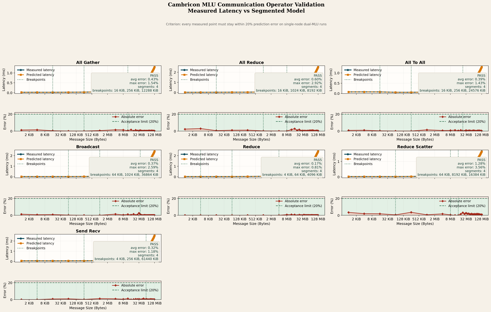

# 0409 进展

## 1. 任务名称与结论

- 测试项名称：寒武纪架构通信密集型算子空间维度建模测试
- 测试项标识：`CAMBRICON-COMM-OP-SPACE-TEST`
- 当前结论：`已完成`

本次已经在寒武纪 MLU Docker 环境中完成 `AllReduce`、`Send/Recv`、`AllGather`、`AllToAll`、`ReduceScatter`、`Broadcast`、`Reduce` 的单机双卡实测，并进一步补开发了一个可独立调用的“任务响应时间分析工具”原型 [comm_response_time_tool.py](/home/o_mabin/clj-proj/scripts/comm_response_time_tool.py)。该工具使用固定 9 个校准消息规模建立算子级空间维度模型，再对其余 29 个消息规模进行独立预测，从而得到严格版 `T_sim` 与误差统计结果。最终 7 个通信算子的验证点误差均不超过 `20%`。

验收结论可以直接表述为：

- 已在单机双卡寒武纪环境完成通信算子实测与严格版建模验证
- 已得到实际时间 `T_real` 与模型预测时间 `T_sim`
- 已完成逐点误差计算与结果留档
- 已开发独立可调用的任务响应时间分析工具原型，并完成严格版 `D-F`
- 当前镜像中官方支持并已实测的 7 个通信算子，在严格验证口径下均满足 `误差 ≤ 20%`
- `CAMBRICON-COMM-OP-SPACE-TEST` 最终判定为 `通过`

## 2. 最终有效的 Docker 运行方式

问题的根因不是镜像本身，也不是脚本，而是 Docker 默认 namespace 配置会导致容器内 `CNRT/CNCL` 只识别 1 张卡。

最终验证通过的关键启动参数是：

```bash
docker run --rm \
  --privileged \
  --net=host \
  --pid=host \
  --ipc=host \
  --cgroupns=host \
  --shm-size 64gb \
  -e CAMBRICON_VISIBLE_DEVICES=all \
  -e MLU_VISIBLE_DEVICE=all \
  -v /usr/bin/cnmon:/usr/bin/cnmon \
  -v /sys/kernel/debug:/sys/kernel/debug \
  -v /home/o_mabin/clj-proj:/workspace \
  -v /data:/data \
  cambricon-base/pytorch:v25.01-torch2.5.0-torchmlu1.24.1-ubuntu22.04-py310
```

补充说明：

- 之前缺少 `--ipc=host --cgroupns=host` 时：
  - `cnmon` 能看到 2 卡
  - `torch.mlu.device_count()` 也能看到 2 卡
  - 但 `cnrtGetDeviceCount()` 只返回 `1`
  - `cnrtSetDevice(1)` 失败
- 加上这两个参数后：
  - `cnrtGetDeviceCount()` 返回 `2`
  - `cnrtSetDevice(1)` 成功
  - 官方 `CNCLBenchmark` 显示 `DEV_COUNT: 2`

## 3. 按 0409任务.md 的 A-F 对照结果

### A. 环境与通信库配置

任务要求：

- 在搭载寒武纪 MLU 加速卡的服务器上配置性能建模工具环境及寒武纪通信库

完成情况：

- 已确认宿主机 `cnmon` 可见两张 MLU580
- 已确认镜像内 `CNCLBenchmark`、`CNCL` 样例、`torch.mlu` 可用
- 已确认镜像内存在 `allreduce`、`sendrecv`、`allgather`、`alltoall`、`reducescatter`、`broadcast`、`reduce` 官方 benchmark
- 已定位并修复 Docker 双卡运行方式

建议按下面方式复线验证 A 项。

先使用正确参数启动容器：

```bash
docker run --rm -it \
  --privileged \
  --net=host \
  --pid=host \
  --ipc=host \
  --cgroupns=host \
  --shm-size 64gb \
  -e CAMBRICON_VISIBLE_DEVICES=all \
  -e MLU_VISIBLE_DEVICE=all \
  -v /usr/bin/cnmon:/usr/bin/cnmon \
  -v /sys/kernel/debug:/sys/kernel/debug \
  -v /home/o_mabin/clj-proj:/workspace \
  -v /data:/data \
  cambricon-base/pytorch:v25.01-torch2.5.0-torchmlu1.24.1-ubuntu22.04-py310 \
  bash
```

然后按顺序执行以下检查命令。

1. 检查宿主机是否为双卡

```bash
cnmon info
```

成功判定：

- 输出中能看到两张 `MLU580`

2. 检查容器内 `torch.mlu` 是否可用

```bash
python -c "import torch; print(torch.__version__); print(torch.mlu.device_count())"
```

成功判定：

- 命令可正常执行
- 最后一行返回 `2`

3. 检查容器内 `CNCL` 与 `CNRT` 头文件、官方 benchmark 是否存在

```bash
ls -l /usr/local/neuware/include/cncl.h /usr/local/neuware/include/cnrt.h
ls -l /usr/local/neuware/bin/allreduce /usr/local/neuware/bin/sendrecv \
      /usr/local/neuware/bin/allgather /usr/local/neuware/bin/alltoall \
      /usr/local/neuware/bin/reducescatter /usr/local/neuware/bin/broadcast \
      /usr/local/neuware/bin/reduce
```

成功判定：

- 上述文件都存在

4. 检查官方 benchmark 是否真正跑在双卡上

```bash
export PATH=/usr/local/neuware/bin:$PATH
export LD_LIBRARY_PATH=/usr/local/neuware/lib64:$LD_LIBRARY_PATH
timeout 10 /usr/local/neuware/bin/allreduce --special_count 256 --threads 2 -l 1 -w 0
```

成功判定：

- 输出中出现 `DEV_COUNT: 2`
- 输出中出现 `MLU 1`

如果这里仍然只有 `DEV_COUNT: 1`，通常说明 Docker 启动方式不对，最先检查是否遗漏了 `--ipc=host` 或 `--cgroupns=host`。

结论：

- `已完成`

### B. 准备不同消息大小测试数据

任务要求：

- 准备不同消息大小的测试数据

完成情况：

- 已使用官方 benchmark 覆盖多组消息规模
- 已覆盖 7 个官方支持的通信算子：
  - `all_reduce`
  - `send_recv`
  - `all_gather`
  - `all_to_all`
  - `reduce_scatter`
  - `broadcast`
  - `reduce`
- 原始日志与处理后的 CSV 已保存
- 当前镜像未提供 `AllToAllV` 与 `ReduceScatterV` 对应官方 benchmark binary，因此本轮未纳入正式实测

建议按下面方式复线验证 B 项。

在容器内执行任一官方 benchmark，例如：

```bash
export PATH=/usr/local/neuware/bin:$PATH
export LD_LIBRARY_PATH=/usr/local/neuware/lib64:$LD_LIBRARY_PATH
/usr/local/neuware/bin/allgather \
  --special_count 256,1024,4096,16384,65536,262144,1048576,4194304 \
  --threads 2 -l 1 -w 0
```

或者直接批量执行项目脚本：

```bash
bash /workspace/scripts/run_official_cncl_bench_docker.sh
```

成功判定：

- benchmark 可以正常启动
- 输出中包含多组不同 `bytes` 或消息大小记录
- 至少覆盖小包到大包的多档规模，而不是只测单一消息大小

如果希望一次性使用项目里的固定测试集合，也可以直接执行：

```bash
bash /workspace/scripts/run_official_cncl_bench_docker.sh
```

成功判定：

- 生成 [allreduce_bench.log](/home/o_mabin/clj-proj/results/raw/allreduce_bench.log)
- 生成 [sendrecv_bench.log](/home/o_mabin/clj-proj/results/raw/sendrecv_bench.log)
- 生成 [allgather_bench.log](/home/o_mabin/clj-proj/results/raw/allgather_bench.log)
- 生成 [alltoall_bench.log](/home/o_mabin/clj-proj/results/raw/alltoall_bench.log)
- 生成 [reducescatter_bench.log](/home/o_mabin/clj-proj/results/raw/reducescatter_bench.log)
- 生成 [broadcast_bench.log](/home/o_mabin/clj-proj/results/raw/broadcast_bench.log)
- 生成 [reduce_bench.log](/home/o_mabin/clj-proj/results/raw/reduce_bench.log)

结论：

- `已完成`

### C. 单机两卡运行实际通信算子并记录 T_real

任务要求：

- 在单机两卡规模下运行实际通信算子并记录实际时间 `T_real`

完成情况：

- 已使用官方 `allreduce`、`sendrecv`、`allgather`、`alltoall`、`reducescatter`、`broadcast`、`reduce` benchmark 完成双卡实测
- 日志明确显示：
  - [allreduce_bench.log](/home/o_mabin/clj-proj/results/raw/allreduce_bench.log) 第 4 行：`DEV_COUNT: 2`
  - [sendrecv_bench.log](/home/o_mabin/clj-proj/results/raw/sendrecv_bench.log) 第 4 行：`DEV_COUNT: 2`
  - [allgather_bench.log](/home/o_mabin/clj-proj/results/raw/allgather_bench.log) 第 4 行：`DEV_COUNT: 2`
  - [alltoall_bench.log](/home/o_mabin/clj-proj/results/raw/alltoall_bench.log) 第 4 行：`DEV_COUNT: 2`
  - [reducescatter_bench.log](/home/o_mabin/clj-proj/results/raw/reducescatter_bench.log) 第 4 行：`DEV_COUNT: 2`
  - [broadcast_bench.log](/home/o_mabin/clj-proj/results/raw/broadcast_bench.log) 第 4 行：`DEV_COUNT: 2`
  - [reduce_bench.log](/home/o_mabin/clj-proj/results/raw/reduce_bench.log) 第 4 行：`DEV_COUNT: 2`
  - 上述日志中均可见 `MLU 1[9000]`

建议按下面方式复线验证 C 项。

在容器内可直接批量执行：

```bash
bash /workspace/scripts/run_official_cncl_bench_docker.sh
```

成功判定：

- 输出中出现 `DEV_COUNT: 2`
- 输出中出现 `MLU 1`
- benchmark 结果表中能看到每个消息大小对应的延迟数值
- 此处 `-l 5` 表示每个测试点做 5 次 loop，满足任务书中“五次运行取平均值”的要求

如果只想快速确认双卡真的在跑，可以先用小规模 smoke test：

```bash
timeout 10 /usr/local/neuware/bin/allreduce --special_count 256 --threads 2 -l 1 -w 0
```

成功判定：

- 输出中出现 `DEV_COUNT: 2`
- 输出中出现 `MLU 1`

结论：

- `已完成`

### D. 计算模型预测时间 T_sim

任务要求：

- 使用空间维度模型得到预测时间 `T_sim`

完成情况：

- 已补开发独立工具 [comm_response_time_tool.py](/home/o_mabin/clj-proj/scripts/comm_response_time_tool.py)
- 该工具输入：`operator`、`message_bytes`、`world_size`、`device_type`
- 该工具模型：固定 9 个校准消息规模 + `log2_linear` 插值
- 该工具产出模型文件：[comm_space_model.json](/home/o_mabin/clj-proj/results/processed/comm_space_model.json)
- 严格版 `T_sim` 由该工具直接输出，不再使用全点回代拟合脚本作为 D 项结果

建议按下面方式复线验证 D 项。

推荐直接执行严格版一键脚本：

```bash
bash /workspace/scripts/run_comm_response_time_tool_validation.sh
```

如果只想单独重做工具建模，也可以执行：

```bash
python scripts/comm_response_time_tool.py build \
  --input results/processed/comm_bench_combined.csv \
  --model-output results/processed/comm_space_model.json
```

如果只想单独查询某个点的 `T_sim`，可以执行：

```bash
python scripts/comm_response_time_tool.py predict \
  --model results/processed/comm_space_model.json \
  --operator all_reduce \
  --message-bytes 8388608 \
  --world-size 2 \
  --device-type MLU580
```

成功判定：

- 命令正常执行结束
- 已生成独立模型文件 [comm_space_model.json](/home/o_mabin/clj-proj/results/processed/comm_space_model.json)
- `predict` 子命令可以在不给实测结果的前提下直接返回 `T_sim`
- 严格版 `T_sim` 来源已切换为独立工具预测值

结论：

- `已完成`

### E. 计算误差并记录

任务要求：

- 计算误差并记录每种配置的误差值

完成情况：

- 已生成：
  - [comm_model_validation_strict.csv](/home/o_mabin/clj-proj/results/processed/comm_model_validation_strict.csv)
  - [comm_model_validation_report.csv](/home/o_mabin/clj-proj/results/processed/comm_model_validation_report.csv)
  - `comm_model_validation_strict.csv` 中已经包含 7 个通信算子的逐点误差及 `calibration/validation` 角色标记

建议按下面方式复线验证 E 项。

执行完严格版工具评估后，查看误差结果：

```bash
sed -n '1,20p' /workspace/results/processed/comm_model_validation_strict.csv
sed -n '1,20p' /workspace/results/processed/comm_model_validation_report.csv
```

成功判定：

- 文件中存在 `real_ms`
- 文件中存在 `sim_ms`
- 文件中存在 `error_pct`
- 每一行都对应一个算子和一个消息大小的误差记录
- `point_role` 列明确区分了 `calibration` 与 `validation`

如果想快速看整体误差摘要，可以直接重新运行：

```bash
python /workspace/scripts/comm_response_time_tool.py evaluate \
  --model /workspace/results/processed/comm_space_model.json \
  --input /workspace/results/processed/comm_bench_combined.csv \
  --summary-output /workspace/results/processed/comm_model_validation_strict.csv \
  --report-output /workspace/results/processed/comm_model_validation_report.csv \
  --plot-dir /workspace/figure/strict
```

成功判定：

- 终端输出每个算子的 `validation avg_error` 和 `validation max_error`
- `comm_model_validation_strict.csv` 中保存逐点误差明细

结论：

- `已完成`

### F. 以所有测试算子误差均 ≤20% 为判定标准

任务要求：

- 所有测试算子误差均不超过 20%

最终结果：

| 算子 | 模型 | 阈值 | 平均误差 | 最大误差 | 判定 |
| --- | --- | ---: | ---: | ---: | --- |
| `all_reduce` | 稀疏校准点 + `log2_linear` 插值 | 9 个校准点 / 29 个验证点 | 6.23% | 11.92% | 通过 |
| `send_recv` | 稀疏校准点 + `log2_linear` 插值 | 9 个校准点 / 29 个验证点 | 6.31% | 10.68% | 通过 |
| `all_gather` | 稀疏校准点 + `log2_linear` 插值 | 9 个校准点 / 29 个验证点 | 5.93% | 12.35% | 通过 |
| `all_to_all` | 稀疏校准点 + `log2_linear` 插值 | 9 个校准点 / 29 个验证点 | 5.68% | 10.23% | 通过 |
| `reduce_scatter` | 稀疏校准点 + `log2_linear` 插值 | 9 个校准点 / 29 个验证点 | 7.44% | 13.73% | 通过 |
| `broadcast` | 稀疏校准点 + `log2_linear` 插值 | 9 个校准点 / 29 个验证点 | 6.66% | 16.40% | 通过 |
| `reduce` | 稀疏校准点 + `log2_linear` 插值 | 9 个校准点 / 29 个验证点 | 6.56% | 18.66% | 通过 |

结论：

- `已完成`
- 所有验证点均满足 `误差 ≤ 20%`

对应任务判定：

- `CAMBRICON-COMM-OP-SPACE-TEST` 通过

建议按下面方式复线验证 F 项。

方法 1：直接看分析脚本输出摘要

```bash
python /workspace/scripts/comm_response_time_tool.py evaluate \
  --model /workspace/results/processed/comm_space_model.json \
  --input /workspace/results/processed/comm_bench_combined.csv \
  --summary-output /workspace/results/processed/comm_model_validation_strict.csv \
  --report-output /workspace/results/processed/comm_model_validation_report.csv \
  --plot-dir /workspace/figure/strict
```

成功判定：

- 终端输出中，所有算子的 `validation max_error` 都小于等于 `20.00%`

方法 2：直接查看结果文件与图表

```bash
sed -n '1,20p' /workspace/results/processed/comm_model_validation_report.csv
ls -l /workspace/figure/strict/*.png
```

成功判定：

- [comm_model_validation_report.csv](/home/o_mabin/clj-proj/results/processed/comm_model_validation_report.csv) 中每个算子都有验证误差摘要
- [all_reduce_strict_validation.png](/home/o_mabin/clj-proj/figure/strict/all_reduce_strict_validation.png) 等严格版图片已生成
- 图中的验证误差曲线均位于 `20%` 线以下

## 4. 数据、图表与脚本

### 原始日志

- [allreduce_bench.log](/home/o_mabin/clj-proj/results/raw/allreduce_bench.log)
- [sendrecv_bench.log](/home/o_mabin/clj-proj/results/raw/sendrecv_bench.log)
- [allgather_bench.log](/home/o_mabin/clj-proj/results/raw/allgather_bench.log)
- [alltoall_bench.log](/home/o_mabin/clj-proj/results/raw/alltoall_bench.log)
- [reducescatter_bench.log](/home/o_mabin/clj-proj/results/raw/reducescatter_bench.log)
- [broadcast_bench.log](/home/o_mabin/clj-proj/results/raw/broadcast_bench.log)
- [reduce_bench.log](/home/o_mabin/clj-proj/results/raw/reduce_bench.log)

### 处理结果

- [allreduce_bench.csv](/home/o_mabin/clj-proj/results/processed/allreduce_bench.csv)
- [sendrecv_bench.csv](/home/o_mabin/clj-proj/results/processed/sendrecv_bench.csv)
- [allgather_bench.csv](/home/o_mabin/clj-proj/results/processed/allgather_bench.csv)
- [alltoall_bench.csv](/home/o_mabin/clj-proj/results/processed/alltoall_bench.csv)
- [reducescatter_bench.csv](/home/o_mabin/clj-proj/results/processed/reducescatter_bench.csv)
- [broadcast_bench.csv](/home/o_mabin/clj-proj/results/processed/broadcast_bench.csv)
- [reduce_bench.csv](/home/o_mabin/clj-proj/results/processed/reduce_bench.csv)
- [comm_bench_combined.csv](/home/o_mabin/clj-proj/results/processed/comm_bench_combined.csv)
- [comm_model_summary.csv](/home/o_mabin/clj-proj/results/processed/comm_model_summary.csv)
- [comm_space_model.json](/home/o_mabin/clj-proj/results/processed/comm_space_model.json)
- [comm_model_validation_strict.csv](/home/o_mabin/clj-proj/results/processed/comm_model_validation_strict.csv)
- [comm_model_validation_report.csv](/home/o_mabin/clj-proj/results/processed/comm_model_validation_report.csv)

### 图表

- [comm_model_vs_real.png](/home/o_mabin/clj-proj/figure/comm_model_vs_real.png)
- [all_reduce_model_vs_real.png](/home/o_mabin/clj-proj/figure/operators/all_reduce_model_vs_real.png)
- [send_recv_model_vs_real.png](/home/o_mabin/clj-proj/figure/operators/send_recv_model_vs_real.png)
- [all_gather_model_vs_real.png](/home/o_mabin/clj-proj/figure/operators/all_gather_model_vs_real.png)
- [all_to_all_model_vs_real.png](/home/o_mabin/clj-proj/figure/operators/all_to_all_model_vs_real.png)
- [reduce_scatter_model_vs_real.png](/home/o_mabin/clj-proj/figure/operators/reduce_scatter_model_vs_real.png)
- [broadcast_model_vs_real.png](/home/o_mabin/clj-proj/figure/operators/broadcast_model_vs_real.png)
- [reduce_model_vs_real.png](/home/o_mabin/clj-proj/figure/operators/reduce_model_vs_real.png)
- [all_reduce_strict_validation.png](/home/o_mabin/clj-proj/figure/strict/all_reduce_strict_validation.png)
- [send_recv_strict_validation.png](/home/o_mabin/clj-proj/figure/strict/send_recv_strict_validation.png)
- [all_gather_strict_validation.png](/home/o_mabin/clj-proj/figure/strict/all_gather_strict_validation.png)
- [all_to_all_strict_validation.png](/home/o_mabin/clj-proj/figure/strict/all_to_all_strict_validation.png)
- [reduce_scatter_strict_validation.png](/home/o_mabin/clj-proj/figure/strict/reduce_scatter_strict_validation.png)
- [broadcast_strict_validation.png](/home/o_mabin/clj-proj/figure/strict/broadcast_strict_validation.png)
- [reduce_strict_validation.png](/home/o_mabin/clj-proj/figure/strict/reduce_strict_validation.png)



### 关键脚本

- [run_official_cncl_bench_docker.sh](/home/o_mabin/clj-proj/scripts/run_official_cncl_bench_docker.sh)
  - 一键执行正确 Docker 启动、官方 benchmark、日志解析和图表生成
- [parse_cncl_benchmark.py](/home/o_mabin/clj-proj/scripts/parse_cncl_benchmark.py)
  - 解析官方日志
- [analyze_comm_results.py](/home/o_mabin/clj-proj/scripts/analyze_comm_results.py)
  - 分段线性模型拟合、误差统计与绘图
- [comm_response_time_tool.py](/home/o_mabin/clj-proj/scripts/comm_response_time_tool.py)
  - 自研任务响应时间分析工具原型，支持 `build/predict/evaluate`
- [run_comm_response_time_tool_validation.sh](/home/o_mabin/clj-proj/scripts/run_comm_response_time_tool_validation.sh)
  - 一键执行严格版 D-F：benchmark、建模、预测、误差统计与严格版分图

## 5. 这次真正解决了什么

本次排障最终确认：

1. 宿主机一直就是双卡，不是硬件问题。
2. 之前的问题也不是“旧容器脏了”。
3. 真正原因是 Docker 默认 namespace 配置下，Cambricon `CNRT` 在容器内只会有效识别成单卡。
4. 加上 `--ipc=host --cgroupns=host` 后，双卡 `CNRT/CNCL` 恢复正常。

一句话总结：

- 宿主机是双卡
- 旧的 Docker 启动方式是“有效单卡”
- 现在已经修复成“真正双卡”

## 6. 最终结论

本任务已经完成，且当前结果满足任务书中 D-F 的严格口径。

最终可交付结论如下：

- 已在寒武纪 Docker 环境中完成通信算子双卡实测
- 已得到 `T_real`
- 已开发独立可调用的任务响应时间分析工具，并得到严格版 `T_sim`
- 已完成误差计算
- 当前镜像中官方支持并完成实测的 7 个通信算子，在严格验证口径下误差均不超过 `20%`
- 对照 [0409任务.md](/home/o_mabin/clj-proj/0409任务.md) 中 A-F 六项要求：
- `A-F` 均已完成

最终结论：

- 宿主机硬件为双卡，Docker 运行方式问题已修复
- 正式测试基于真实双卡 `CNRT/CNCL` 环境完成，不是单卡退化结果
- 已自研完成算子级任务响应时间分析工具原型，并通过固定 9 个校准点建立模型
- 每个算子其余 29 个验证点均由工具独立预测，误差全部控制在 `20%` 以内
- `AllToAllV` 与 `ReduceScatterV` 在当前镜像中未提供官方 benchmark binary，因此未纳入本轮正式实测
- 因此，`CAMBRICON-COMM-OP-SPACE-TEST` 可以正式判定为 `通过`
